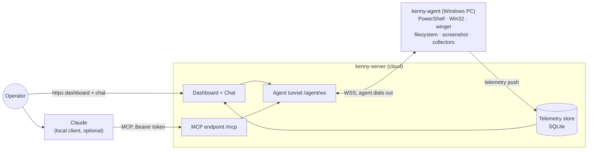

# kenny

Self-hosted remote administration **and fleet monitoring** for Windows PCs in a family
setting, operated through **Claude** (MCP) and a web **dashboard**.



- **kenny-server** (Python / FastMCP): stable MCP endpoint for Claude, the agent tunnel,
  the telemetry store (SQLite), and the operator dashboard. One ASGI app, one port.
- **kenny-agent** (Rust, single binary): runs on each Windows PC, dials **out** to the
  server (NAT/firewall friendly), executes tool calls in the user's session, and pushes
  periodic health snapshots.

## Features

### Fleet monitoring
- **Push telemetry** from each PC (default every 15 min, plus an immediate first push),
  persisted in SQLite with ~30-day retention and a per-agent history.
- **~25 telemetry sections**: disk + SMART, memory, processes, CPU/thermals, uptime,
  network + routing, Wi‑Fi quality, Defender (+ quarantine), third-party AV, firewall,
  BitLocker encryption, Windows Update + app updates, reboot-pending, OS support/EOL,
  services, autostart, peripherals, printers, battery, reliability, time sync.
- **Server-side health rules** (authoritative): e.g. disk > 80 % ⇒ warn / ≥ 95 % ⇒ crit,
  Defender real-time off ⇒ crit, with worst-of roll-up per agent and across the fleet.

### Operator dashboard (web UI)
- Fleet view with a **traffic-light** per PC and the fleet's worst-of health.
- Per-agent **drill-down**: each telemetry section with status + rule reason (click a section for a
  structured detail popup), a **health trend**, and a searchable, paged **tool-call audit log**.
- Action buttons: refresh now, reinstall, re-share, update agent; onboard a new PC from **Add a PC**
  (installer / share link).
- Single-page, dependency-light; cookie login at `/login`.

### Remote administration — capability tools
- **Shell**: `powershell.exec`
- **Packages**: `winget.list` · `winget.install` · `winget.uninstall` · `winget.update`
- **Files**: `fs.list` · `fs.search` · `fs.read` · `fs.disk_usage`
- **Diagnostics**: `diag.processes` · `diag.services` · `diag.eventlog` · `diag.autostart`
- **Network**: `net.config` · `net.dns_flush` · `net.adapter_reset`
- **Screen**: `screen.capture` · **Telemetry**: `telemetry.collect` · **Agent mgmt**: `agent.update`
- **Server-only orchestration**: `list_agents` · `select_agent` · `fleet_overview` ·
  `agent_health` · `agent_snapshot`
- Windows-only tools have **portable Linux fallbacks**, so the agent builds and runs in CI/dev.

### Two ways to drive it with Claude
- **Local MCP client** → `/mcp` (FastMCP Streamable HTTP), operator token as bearer.
- **Server-hosted chat** in the dashboard (no local client): a Claude tool-use loop bridged to the
  same tools, with prompt-cached system + tool schemas; model configurable (default
  `claude-sonnet-4-6`).
- **Confirm-gate**: read-only tools auto-run; state-changing tools (`powershell.exec`, `winget`
  writes, `net.dns_flush`/`adapter_reset`, `agent.update`) require explicit operator confirmation.

### Agent distribution & lifecycle
- **One-click installer download** from the GUI: a prebuilt binary + a generated `install.bat`
  carrying the server URL, agent id, and a freshly minted token.
- **Expiring, one-time shareable link** (`/d/…`) for the target user — no operator login needed.
- **Windows service**: self-install (`install` / `uninstall` / `run-service`) via the
  `windows-service` crate, auto-start with restart-on-failure recovery.
- **Server-triggered self-update** (`agent.update`): download → SHA‑256 verify → staged swap with
  rollback → service restart; the agent reconnects on the new version.

### Transport & connectivity
- Agent **dials out** over WSS (NAT/firewall friendly) and never listens.
- **Frozen, versioned JSON wire contract** (`PROTOCOL_VERSION 0.2`) with golden fixtures
  round-tripped by both sides; request/response correlation, ping/pong heartbeat, and
  exponential-backoff reconnect.

### Security & auth
- **Operator bearer token** for MCP + API + UI (multiple operator tokens supported); cookie login
  with the `Secure` flag under TLS.
- **Per-agent tokens** in a SQLite token store with a **rotation endpoint**; the agent authenticates
  on `register`.
- TLS server identity (`wss`), confirm-gate for destructive actions, and a tool-call audit log.

### Deployment & ops
- **Docker image + Compose** (persistent data volume, optional Caddy TLS profile for `wss`/`https`).
- **GHCR release workflow** on tag `v*`: server image + Windows agent binary (SHA‑256, optional
  Authenticode signing).
- **Dependabot** for pip, cargo, GitHub Actions, and the Docker base image.
- **CI**: server tests + lint, agent `fmt`/`clippy`/`test`/`build`, a Windows job for
  `#[cfg(windows)]` code, and a **real agent↔server e2e** job.
- **`/security-review`** command files deduplicated security issues for kenny's weak points.

### Engineering
- **Contract-first** (`docs/protocol.md` + `docs/fixtures/`), **ADRs** (MADR) for every significant
  decision, and Claude Code **skills/commands + subagents** for repeatable changes.

## Documentation

- **[User guide](docs/user-guide.md)** — operator workflows: dashboard, chat, running tools,
  adding/updating agents (with diagrams).
- **[Setup & operations](docs/setup.md)** — hosting, environment variables, TLS, building &
  distributing the agent, releases.

## How it fits together

- The agent⇄server **wire contract** is the single source of truth:
  [`docs/protocol.md`](docs/protocol.md) + [`docs/fixtures/`](docs/fixtures). Both
  components round-trip the golden fixtures so they cannot drift.
- Why things are the way they are: architecture decisions in
  [`docs/adr/`](docs/adr) (MADR).
- Coding conventions for agents/humans: [`CLAUDE.md`](CLAUDE.md) and the per-component
  `CLAUDE.md` files (deliberately free of architecture/contract duplication).

## Develop

```bash
# server
cd kenny-server && pip install -e ".[dev]" && pytest

# agent (builds on Linux too, via cfg fallbacks)
cd kenny-agent && cargo test && cargo build
```

Helper commands inside Claude Code: `/new-adr`, `/add-tool`, `/add-collector`,
`/contract-check`, `/e2e`, `/security-review`.

## Authentication

- **Agent → server:** per-agent token in the `register` frame (`KENNY_AGENT_TOKENS`).
- **Operator → server:** one operator bearer token (`KENNY_OPERATOR_TOKEN`) gates the
  MCP endpoint, the `/api` routes, and the web UI (browser logs in at `/login`). Claude
  sends `Authorization: Bearer <token>`. See `docs/adr/0008-operator-authentication.md`.
- **Server → agent:** TLS — run the server behind **`wss`/`https`** in production; the
  agent dials a known `wss://…/agent/ws` URL. `ws://` and the dev token fallbacks are
  for local use only.

## Status

Both components are implemented against the contract: capability tools, telemetry collectors +
health rules, the fleet dashboard, a server-hosted Claude chat (with a confirm-gate for
state-changing tools), operator + agent auth (token store with rotation), the Windows service +
server-triggered self-update, agent installer download, Docker/Compose, and a GHCR release
workflow. Runtime-only Windows behaviors (service control, live self-update swap) are
compile-verified via cross-build and the Windows CI job; real-hardware verification, TLS hardening,
and code-signing are operational follow-ups (see `docs/adr/`).
