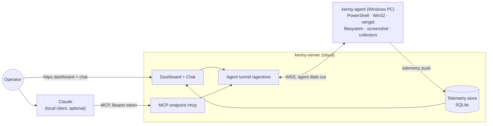

# kenny

Self-hosted remote administration **and fleet monitoring** for Windows PCs in a family
setting, operated through **Claude** (MCP) and a web **dashboard**.



- **kenny-server** (Python / FastMCP): stable MCP endpoint for Claude, the agent tunnel,
  the telemetry store (SQLite), and the operator dashboard. One ASGI app, one port.
- **kenny-agent** (Rust, single binary): runs on each Windows PC, dials **out** to the
  server (NAT/firewall friendly), executes tool calls in the user's session, and pushes
  periodic health snapshots.

## Documentation

- **[User guide](docs/user-guide.md)** — operator workflows: dashboard, chat, running tools,
  adding/updating agents (with diagrams).
- **[Setup & operations](docs/setup.md)** — hosting, environment variables, TLS, building &
  distributing the agent, releases.

## How it fits together

- The agent⇄server **wire contract** is the single source of truth:
  [`docs/protocol.md`](docs/protocol.md) + [`docs/fixtures/`](docs/fixtures). Both
  components round-trip the golden fixtures so they cannot drift.
- Why things are the way they are: architecture decisions in
  [`docs/adr/`](docs/adr) (MADR).
- Coding conventions for agents/humans: [`CLAUDE.md`](CLAUDE.md) and the per-component
  `CLAUDE.md` files (deliberately free of architecture/contract duplication).

## Develop

```bash
# server
cd kenny-server && pip install -e ".[dev]" && pytest

# agent (builds on Linux too, via cfg fallbacks)
cd kenny-agent && cargo test && cargo build
```

Helper commands inside Claude Code: `/new-adr`, `/add-tool`, `/add-collector`,
`/contract-check`, `/e2e`, `/security-review`.

## Authentication

- **Agent → server:** per-agent token in the `register` frame (`KENNY_AGENT_TOKENS`).
- **Operator → server:** one operator bearer token (`KENNY_OPERATOR_TOKEN`) gates the
  MCP endpoint, the `/api` routes, and the web UI (browser logs in at `/login`). Claude
  sends `Authorization: Bearer <token>`. See `docs/adr/0008-operator-authentication.md`.
- **Server → agent:** TLS — run the server behind **`wss`/`https`** in production; the
  agent dials a known `wss://…/agent/ws` URL. `ws://` and the dev token fallbacks are
  for local use only.

## Status

Both components are implemented against the contract: capability tools, telemetry collectors +
health rules, the fleet dashboard, a server-hosted Claude chat (with a confirm-gate for
state-changing tools), operator + agent auth (token store with rotation), the Windows service +
server-triggered self-update, agent installer download, Docker/Compose, and a GHCR release
workflow. Runtime-only Windows behaviors (service control, live self-update swap) are
compile-verified via cross-build and the Windows CI job; real-hardware verification, TLS hardening,
and code-signing are operational follow-ups (see `docs/adr/`).
