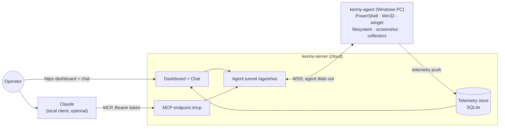

<div align="center">


# 🐕 kenny

**Self-hosted remote administration _and fleet monitoring_ for Windows PCs, driven by Claude (MCP) and a web dashboard.**

[](LICENSE)
[](https://github.com/t11z/kenny/actions/workflows/ci.yml)
[](https://t11z.github.io/kenny/)
[](https://github.com/t11z/kenny/releases)

</div>

kenny started as a way to look after the family's Windows PCs — keep an eye on disk space and
Defender, fix things over the phone without "can you read me what it says" — operated through
Claude instead of a clunky console. It works for any small fleet you administer with consent.



- **kenny-server** (Python / FastMCP): stable MCP endpoint for Claude, the agent tunnel,
  the telemetry store (SQLite), and the operator dashboard. One ASGI app, one port.
- **kenny-agent** (Rust, single binary): runs on each Windows PC, dials **out** to the
  server (NAT/firewall friendly), executes tool calls in the user's session, and pushes
  periodic health snapshots.

## ✨ Features

### Fleet monitoring
- **Push telemetry** from each PC (default every 15 min, plus an immediate first push),
  persisted in SQLite with ~30-day retention and a per-agent history.
- **~25 telemetry sections**: disk + SMART, memory, processes, CPU/thermals, uptime,
  network + routing, Wi‑Fi quality, Defender (+ quarantine), third-party AV, firewall,
  BitLocker encryption, Windows Update + app updates, reboot-pending, OS support/EOL,
  services, autostart, peripherals, printers, battery, reliability, time sync.
- **Server-side health rules** (authoritative): e.g. disk > 80 % ⇒ warn / ≥ 95 % ⇒ crit,
  Defender real-time off ⇒ crit, with worst-of roll-up per agent and across the fleet.

### Operator dashboard (web UI)
- Fleet view with a **traffic-light** per PC and the fleet's worst-of health.
- Per-agent **drill-down**: each telemetry section with status + rule reason (click a section for a
  structured detail popup), a **health trend**, and a searchable, paged **tool-call audit log**.
- Action buttons: refresh now, **remote help** (Quick Assist), reinstall, re-share, update agent;
  onboard a new PC from **Add a PC** (installer / share link).
- Single-page, dependency-light; cookie login at `/login`.

### Remote administration — capability tools
- **Shell**: `powershell_exec`
- **Packages**: `winget_list` · `winget_install` · `winget_uninstall` · `winget_update`
- **Files**: `fs_list` · `fs_search` · `fs_read` · `fs_disk_usage`
- **Diagnostics**: `diag_processes` · `diag_services` · `diag_eventlog` · `diag_autostart`
- **Network**: `net_config` · `net_dns_flush` · `net_adapter_reset`
- **Screen**: `screen_capture` · **Remote help**: `remotehelp_status` · `remotehelp_start` ·
  `remotehelp_stop` (Quick Assist concierge) · **Telemetry**: `telemetry_collect` ·
  **Agent mgmt**: `agent_update`
- **Server-only orchestration**: `list_agents` · `select_agent` · `fleet_overview` ·
  `agent_health` · `agent_snapshot`
- Windows-only tools have **portable Linux fallbacks**, so the agent builds and runs in CI/dev.

### Two ways to drive it with Claude
- **Local MCP client** → `/mcp` (FastMCP Streamable HTTP), operator token as bearer.
- **Server-hosted chat** in the dashboard (no local client): a Claude tool-use loop bridged to the
  same tools, with prompt-cached system + tool schemas; model configurable (default
  `claude-sonnet-4-6`).
- **Confirm-gate**: read-only tools auto-run; state-changing tools (`powershell_exec`, `winget`
  writes, `net_dns_flush`/`adapter_reset`, `remotehelp_start`/`_stop`, `agent_update`) require
  explicit operator confirmation.

### Agent distribution & lifecycle
- **One-click installer download** from the GUI: a prebuilt binary + a generated `install.bat`
  carrying the server URL, agent id, and a freshly minted token.
- **Expiring, one-time shareable link** (`/d/…`) for the target user — no operator login needed.
- **Windows service**: self-install (`install` / `uninstall` / `run-service`) via the
  `windows-service` crate, auto-start with restart-on-failure recovery.
- **Server-triggered self-update** (`agent_update`): download → SHA‑256 verify → staged swap with
  rollback → service restart; the agent reconnects on the new version.

### Transport & connectivity
- Agent **dials out** over WSS (NAT/firewall friendly) and never listens.
- **Frozen, versioned JSON wire contract** (`PROTOCOL_VERSION 0.7`) with golden fixtures
  round-tripped by both sides; request/response correlation, ping/pong heartbeat, and
  exponential-backoff reconnect.

### Security & auth
- **Operator bearer token** for MCP + API + UI (multiple operator tokens supported); cookie login
  with the `Secure` flag under TLS.
- **Per-agent tokens** in a SQLite token store with a **rotation endpoint**; the agent authenticates
  on `register`.
- A **local kill-switch** (tray) and a deterministic, always-on **agent-side safety guard** that
  refuses individually dangerous calls regardless of operator approval.
- TLS server identity (`wss`), confirm-gate for destructive actions, and a tool-call audit log.

### Engineering
- **Contract-first** (`docs/protocol.md` + `docs/fixtures/`), **ADRs** (MADR) for every significant
  decision, and Claude Code **skills/commands + subagents** for repeatable changes.

## 📚 Documentation

The full docs site: **<https://t11z.github.io/kenny/>** (built from `docs/` with MkDocs Material).

- **[User guide](docs/user-guide.md)** — operator workflows: dashboard, chat, running tools,
  adding/updating agents (with diagrams).
- **[Setup & operations](docs/setup.md)** — hosting, environment variables, TLS, building &
  distributing the agent, releases.
- **[Wire protocol](docs/protocol.md)** + **[fixtures](docs/fixtures)** — the agent⇄server contract
  (single source of truth; both sides round-trip the fixtures so they cannot drift).
- **[Architecture decisions](docs/adr)** — MADR records for every significant decision.

## 🚀 Quickstart

```bash
# Server (Docker Compose): dashboard, MCP endpoint, agent tunnel on one port
cp .env.example .env   # set KENNY_OPERATOR_TOKEN etc. (see docs/setup.md)
docker compose up -d
```

Then open the dashboard, use **Add a PC** to download an installer for each Windows machine. Full
details — TLS, environment variables, building the agent — are in **[docs/setup.md](docs/setup.md)**.

## 🛠️ Develop

```bash
# server
cd kenny-server && pip install -e ".[dev]" && pytest

# agent (builds on Linux too, via cfg fallbacks)
cd kenny-agent && cargo test && cargo build
```

Helper commands inside Claude Code: `/new-adr`, `/add-tool`, `/add-collector`,
`/contract-check`, `/e2e`, `/security-review`. See **[CONTRIBUTING.md](CONTRIBUTING.md)**.

## 🤝 Community & contributing

- **[Contributing guide](CONTRIBUTING.md)** — build/test, the contract-first workflow, and how to
  add a tool or a telemetry collector.
- **[Code of Conduct](CODE_OF_CONDUCT.md)** — Contributor Covenant.
- **[Security policy](SECURITY.md)** — please report vulnerabilities **privately**, never in a
  public issue (kenny is a remote-admin tool).
- Questions and ideas: **[GitHub Discussions](https://github.com/t11z/kenny/discussions)**.

## 📄 License

kenny is licensed under the **GNU Affero General Public License v3.0** ([AGPL-3.0-only](LICENSE)).
Because the server is network-facing, the AGPL's §13 means anyone who runs a modified kenny as a
service must offer its source to users.

## Status

Both components are implemented against the contract: capability tools, telemetry collectors +
health rules, the fleet dashboard, a server-hosted Claude chat (with a confirm-gate for
state-changing tools), operator + agent auth (token store with rotation), the Windows service +
server-triggered self-update, agent installer download, Docker/Compose, and a GHCR release
workflow. Runtime-only Windows behaviors (service control, live self-update swap, Quick Assist)
are compile-verified via cross-build and the Windows CI job; real-hardware verification, TLS
hardening, and code-signing are operational follow-ups (see `docs/adr/`).
