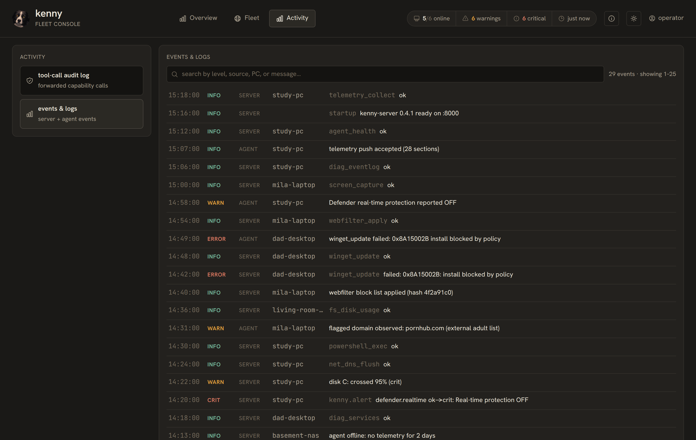

# Alerting, digests & forecasts

kenny evaluates every telemetry snapshot with authoritative server-side health rules and
surfaces warn/crit on the dashboard — but in a family setting nobody watches a fleet
dashboard routinely. This page covers the **push channel** that reaches the operator's
phone when something changes for the worse (or recovers), the **change and forecast**
findings that ride the same channel, and the **weekly digest**. It is entirely
server-side: no protocol bump, no agent involvement, thresholds stay in `health_rules.py`
(see [ADR-0029](adr/0029-push-alerting-ntfy-webhook-and-weekly-digest.md) and
[ADR-0030](adr/0030-server-side-diff-and-trend-engine.md)).

## Push alerting

A background loop on the server re-runs the health rules over **every known agent's**
latest snapshot on a short interval (default 60 s) and notifies on **transitions only** —
not on every push:

- **Escalations to `crit` always fire** (`ok→crit`, `warn→crit`).
- **`warn` transitions respect a per-scope cooldown** (default 1 h) so a flapping section
  is bounded to one alert plus one recovery per window — no reminder spam.
- **A recovery is only announced if the degrading episode was itself announced.** An
  improvement that nobody was told about stays silent, and `crit→warn` updates state
  quietly.

The persisted flap-suppression state means a server restart never re-fires alerts for
conditions that were already notified.

!!! note "Offline detection is push-derived"
    An agent counts as **offline** when its newest snapshot is older than the offline
    threshold (default 2700 s = three missed 15-min pushes) **and** the in-memory registry
    holds no live tunnel connection. Health evaluation is skipped for offline agents, so a
    stale snapshot can't flap. Offline PCs that are simply switched off will alert — tune
    `KENNY_ALERT_OFFLINE_AFTER_SECS` or disable the loop entirely with
    `KENNY_ALERT_INTERVAL_SECS=0` if that is noise for your fleet.

Every emitted alert is also written to the **events table** (`kind='alert'`) as an audit
trail and as the weekly digest's input, so it shows up in the dashboard's **Activity →
events & logs** view with no extra UI plumbing.

<figure markdown>

<figcaption>Emitted alerts and server/agent events in the Activity → events & logs view.</figcaption>
</figure>

## Change notifications

A diff step in the same loop compares **consecutive snapshots** (once per *new* snapshot,
tracked by a persisted cursor — never per evaluation tick, and never re-diffed after a
restart) and reports what appeared, disappeared or changed in the inventory sections:

| Section | Diffed on |
|---------|-----------|
| `autostart` | entry added/removed, command changed |
| `services` | service added/removed, start type changed |
| `peripherals` | device added/removed |
| `installed_software` | app added/removed, version changed |
| `browser_extensions` | extension added/removed |
| `listening_ports` | port added/removed |
| `scheduled_tasks` | task added/removed, action changed |
| `local_accounts` | account added/removed, admin/enabled changed |

Changes are batched into **one notification per host**. `local_accounts` changes (a new
account, or one flipped to admin/enabled) **escalate to high priority** — the
highest-signal security question in a family fleet. **Sections absent from either
snapshot are skipped**, so rolling out a new collector never floods the diff with "added"
rows for a whole section.

## Forecasts

`trends.py` fits ordinary least squares over the per-day history (one representative
snapshot per UTC day). Forecasts are deliberately shy — they need at least 5 daily
points, a genuinely rising slope and a decent fit (r² ≥ 0.5), else they return nothing
rather than a scary made-up number:

- **Disk-fill forecast** — *days until full* per volume. Under **~14 days** raises an
  alert (re-firing at most every 24 h); under **~30 days** shows as an Overview KPI and in
  the weekly digest.
- **Battery drift** — health change as **percent per 30 days**; a meaningful decline
  appears in the digest.

These same computations feed the per-agent **AI Forecast** card at the top of the agent
drill-down, which synthesizes them (with the inventory diff) into a short prose outlook —
see [`dashboard.md`](dashboard.md).

## Weekly digest

A plain-text weekly summary is scheduled inside the same loop and sent on the same
channels at low priority. It renders — entirely from data already in the stores — the
fleet health mix, degraded hosts, 7-day alert / change / crit counts, disk-fill
forecasts, battery drift, pending reboots / failed updates / OS EOL, and 7-day screen
time.

- Scheduled by default **Monday 08:00** (`KENNY_DIGEST_DAY` / `KENNY_DIGEST_HOUR`); the
  last-sent time is persisted so a restart never double-sends, and the first digest
  arrives at the next scheduled slot rather than on install.
- Only sent if `KENNY_DIGEST_ENABLED` is on **and** at least one notifier is configured.
- Preview it without sending via the operator-only endpoint **`GET /api/digest/preview`**.

## Notification channels

Delivery goes through two best-effort channels, **both off unless configured** (a single
HTTP POST each):

| Channel | Configure with | Payload |
|---------|----------------|---------|
| **ntfy** | `KENNY_NTFY_URL` (+ optional `KENNY_NTFY_TOKEN` bearer) | POST body to an ntfy topic; title/priority/tags as headers — works out of the box with the ntfy phone apps |
| **Generic webhook** | `KENNY_WEBHOOK_URL` | JSON POST (`kind`, `title`, `body`, `priority`, `tags`, `agent_id`, `at`) |

Delivery is strictly best-effort: send errors are logged and swallowed, a dead target
never stalls or kills the loop. **With no channel configured, evaluation still runs and
records alert history — it just pushes nothing.**

## Configuration

Alerting environment variables (see [`setup.md`](setup.md) for the full list):

| Variable | Default | Purpose |
|----------|---------|---------|
| `KENNY_ALERT_INTERVAL_SECS` | `60` | Evaluation interval; `0` disables the loop |
| `KENNY_ALERT_COOLDOWN_SECS` | `3600` | Per-scope flap suppression window |
| `KENNY_ALERT_OFFLINE_AFTER_SECS` | `2700` | Offline after this (three missed 15-min pushes) |
| `KENNY_DIGEST_ENABLED` | `1` | Send the weekly digest |
| `KENNY_DIGEST_DAY` | `mon` | Digest day of week |
| `KENNY_DIGEST_HOUR` | `8` | Digest hour (0–23) |
| `KENNY_NTFY_URL` | *(empty)* | ntfy topic URL; empty = channel off |
| `KENNY_NTFY_TOKEN` | *(empty)* | Optional ntfy bearer token |
| `KENNY_WEBHOOK_URL` | *(empty)* | Generic JSON webhook URL; empty = channel off |

## See also

- [`setup.md`](setup.md) — hosting, TLS, and the full environment-variable list
- [`dashboard.md`](dashboard.md) — the Overview KPIs and the per-agent AI Forecast card
- [`telemetry.md`](telemetry.md) — the sections and health rules these alerts evaluate
- [ADR-0029](adr/0029-push-alerting-ntfy-webhook-and-weekly-digest.md) — push alerting & weekly digest
- [ADR-0030](adr/0030-server-side-diff-and-trend-engine.md) — server-side diff & trend engine
