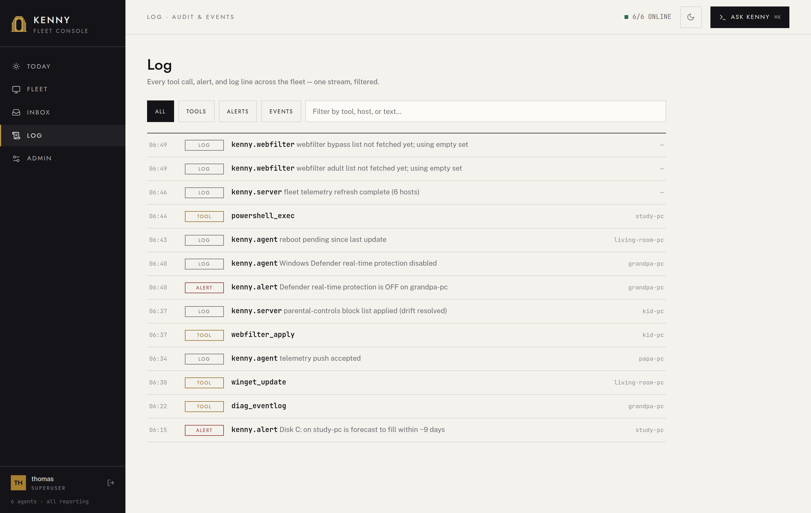

# Alerting, digests & forecasts

kenny evaluates every telemetry snapshot with authoritative server-side health rules and
surfaces warn/crit on the dashboard — but in a family setting nobody watches a fleet
dashboard routinely. This page covers the **push channel** that reaches the operator's
phone when something needs action now, the **daily summary** that collects what can wait,
the **change and forecast** findings, and the **weekly digest**. It is entirely
server-side: no protocol bump, no agent involvement, thresholds stay in `health_rules.py`
(see [ADR-0027](adr/0027-push-alerting-ntfy-webhook-and-weekly-digest.md),
[ADR-0067](adr/0067-alert-delivery-is-routed-by-actionability.md) and
`diffs.py` / `trends.py`).

## Who gets interrupted

Every notification carries a **route** that decides whether it interrupts anyone. The
route is independent of whether it opens a [ticket](#an-alert-can-open-a-ticket): routing
decides *interruption*, auto-ticket rules decide *work*.

| Event | Route | What reaches a person |
|-------|-------|-----------------------|
| A section escalates to `crit` | **push** | One message now. Any `warn` lines from the same pass ride along as context |
| A section escalates to `warn` only | **daily** | A line in the next daily summary |
| A pushed episode recovers | **push** | Discord edits the original message; ntfy gets a silent low-priority note |
| An episode that was never pushed recovers | **record** | Nothing |
| A recovery the operator caused (a suppression) | **record** | Nothing. A Discord message is still edited |
| A host goes silent for `KENNY_ALERT_MISSING_AFTER_DAYS` | **daily** | A line in the next daily summary |
| A host goes offline or comes back | — | Nothing. Offline only pauses health evaluation |
| An inventory change on the allowlist | **push** | One message now |
| Any other inventory change | **record** | Nothing (Log page, digest counts) |
| A disk-fill forecast starts | **daily** | A line in the next daily summary, once per episode |
| Weekly digest | **push** | One message a week |

Human channels (ntfy, Discord) receive `push` only. The generic webhook is a machine
integration point: it receives every route, labelled with a `route` field, and filters for
itself. Every route writes the same events-table row and makes the same ticket decision.

## Push alerting

A background loop on the server re-runs the health rules over **every known agent's**
latest snapshot on a short interval (default 60 s) and notifies on **transitions only** —
not on every push. The rules below decide *whether* a transition produces a notification;
its route (above) decides who hears about it:

- **Escalations to `crit` bypass the cooldown** (`ok→crit`, `warn→crit`).
- **`warn` transitions respect a per-scope cooldown** (default 1 h) so a flapping section
  is bounded to one alert plus one recovery per window — no reminder spam.
- **An escalation that cannot be sent yet is held, not dropped.** A cooldown used to
  swallow a warn outright: the stored status advanced to the new value while nothing was
  sent, so the next pass saw no change and the warning was lost for the whole episode. A
  candidate now waits in a `pending:section:<name>` scope and is delivered on the first
  pass that may send it, without the condition having to change again.
- **Some sections must be confirmed before they alarm.** A section listed in
  `health_rules.CONFIRM_BEFORE_ALARM` — today `reliability` — has to report the same
  incident on a **newer** `collected_at` before it notifies. The loop runs every 60 s over
  a snapshot that changes every ~900 s, and `reliability` reads a rolling 7-day window
  whose contents shift as events age out of it, so one evaluation over one snapshot was
  enough to page someone and open a ticket for a finding that was gone by the next push.
  The cost is one push interval of latency on a genuine incident.
- **A recovery is only announced if the degrading episode was itself announced.** An
  improvement that nobody was told about stays silent, and `crit→warn` updates state
  quietly.
- **Posture never notifies.** A section in the `posture` tier (an unencrypted drive, a
  remote-access port, idle updater services — see the status model in
  [telemetry.md](telemetry.md#status-model)) is a standing fact, not an event: every
  transition into or out of it only updates state, which is what gives the finding its
  age on the host page. It is listed once a week in the digest's `Posture:` line.
- **The body is the finding, not the transition.** A line reads
  `[CRIT] disk: C: 97% full (>=95%)` and a recovery `[RESOLVED] disk: C: 50% full`; the
  title names the worst escalated section's reason. The `ok -> crit` bookkeeping stays
  on the Log page.

The persisted flap-suppression state means a server restart never re-fires alerts for
conditions that were already notified.

!!! note "This loop scores reliability exactly like the dashboard"
    The `reliability` section is scored on whether each event pattern is still happening
    and on the severity the categorizer assigned it — never on raw volume — and the
    categorizer's verdicts are persisted and stamped onto every snapshot read (ADR-0058).
    So the alert loop, the weekly digest below, the fleet list and the dashboard all reach
    one verdict per host: a reboot storm that wrote 80 identical errors a week ago never
    pages anyone, and a pattern firing every day does. An operator-suppressed pattern
    (ADR-0041) is excluded from that scoring everywhere it runs. See the `reliability` row
    in [telemetry.md](telemetry.md#telemetry-sections) and
    [Alarm suppression](telemetry.md#alarm-suppression).

!!! note "Offline is silent; missing is not"
    An agent counts as **offline** when its newest snapshot is older than the offline
    threshold (default 2700 s = three missed 15-min pushes) **and** the in-memory registry
    holds no live tunnel connection. Health evaluation is skipped for offline agents, so a
    stale snapshot can't flap. Being offline notifies no one: a PC that is switched off is
    not an incident. A host with no telemetry for `KENNY_ALERT_MISSING_AFTER_DAYS`
    (default 7) is **missing**. Its agent is broken or gone, which nobody would otherwise
    notice, so it appears once in the daily summary and opens a ticket. When it reports
    again, the ticket resolves quietly.

Every emitted alert is also written to the **events table** (`kind='alert'`) as an audit
trail and as the weekly digest's input, so it shows up in the dashboard's **[Log](dashboard.md#log)**
page with no extra UI plumbing.

<figure markdown>

<figcaption>Emitted alerts and server/agent events in the Log page, filterable by the ALERTS and EVENTS chips.</figcaption>
</figure>

## An alert can open a ticket

A genuine alert (not a recovery, not the digest) can also open a [ticket](itsm.md) — the
same ITSM record a Discord conversation or a dashboard action produces, so a
Defender-disabled or a disk-forecast notification arrives with somewhere to work it rather
than just a push you have to remember. This runs **after** delivery and is strictly
best-effort: a failure to open the ticket is logged and swallowed, never lets a failing
side effect make an alert late or lost — alerting must not become less reliable by gaining
one.

An alert-origin ticket has **no requester** — it belongs to the fleet, not a person — so it
is operator-only in the [Inbox](dashboard.md#inbox): a scoped `user` never sees it. It
starts life pinned to the alerting agent, at `high` priority for a `high`/`urgent`
notification and `normal` otherwise, with the alert's own message as its opening summary.

### One open ticket per subject

A condition that keeps re-crossing its threshold would otherwise mint a fresh ticket every
time it did. Instead, an alert is keyed by its **subject** — the host, plus the sections it
is about (or the producer's name, for `offline`, which is about the host itself). While a
ticket for that subject is still open, the alert is recorded **on that ticket** rather than
opening a second one, and it shows up in the ticket's own
[alert history](dashboard.md#ticket-detail).

Two consequences worth knowing:

- A health finding and a disk-fill forecast about the same volume are **one** case. Both
  name the `disk` section, so the forecast attaches to the ticket the acute finding opened,
  or the other way round.
- An **inventory change** never shares a ticket with a health finding, even on the same
  section. "a new service appeared" and "a service is failing" are different kinds of fact:
  only the second can come back to `ok`, so only the second has a current state to check.

A `resolved` ticket does **not** suppress a new one: once somebody has dealt with the
condition, its return is news again.

### Which events open a ticket is configurable

By default, every genuine alert — a health escalation, a host going missing, a disk-fill
forecast — opens a ticket, and a recovery, an inventory change, and the weekly digest never
do. An operator can narrow or widen that per fleet or per host from **Admin → Alarm
rules** ([auto-ticket rules](dashboard.md#alarm-rules)), or via the `ticket_rule_*`
MCP tools. Each rule names an event type (`health` / `offline` / `disk_forecast` /
`change`), an optional section and host, and a decision: `open_all` (always), `open_crit`
(only when the subject is `crit`) or `never`.

Two practical cases this solves:

- **A machine that is retired but not yet removed** keeps a missing ticket open. A `never`
  rule on `offline` for that host stops the ticket without removing the finding from the
  daily summary or the events-table audit trail.
- **Inventory changes never open a ticket by default**, even though a new local administrator
  account is exactly the kind of thing worth a ticket. An `open_all` rule on `change` with
  section `local_accounts` promotes it.

One section departs from the `open_all` default: **a `reliability` warn does not open a
ticket**, only a `reliability` crit does. What that section warns about is real but not
urgent — a PC that asks for its BitLocker recovery key on every restart, one unexpected
restart on an otherwise healthy machine. Those are worth seeing on the host page and worth
one notification; on a four-host family fleet, one queue item each is what buried the
queue. Any operator rule still overrides this.

Recoveries and the weekly digest can never open a ticket, no matter what rule is written — the
rule engine only ever narrows or widens *genuine alerts*, and running the empty rule table
through the same decision path reproduces this section's coded default exactly.

### A ticket an alert opened closes when the condition goes

A recovery **resolves** the ticket its alert opened, matched on the same subject key the
ticket was opened with. Without it the surface only ever accumulated: a recovery is never
itself ticketed, `crit→warn` is silent, and the ticket sweep does not read health — so an
automatically opened ticket could only ever be closed by a person, even after the condition
had cleared.

This includes clearing it by decision rather than by repair: adding a reliability
suppression rule re-evaluates the affected hosts immediately, which produces the ordinary
recovery transition, which closes the ticket. Muting a pattern takes back the work it
created instead of leaving it in the queue.

## Change notifications

A diff step in the same loop compares **consecutive snapshots** (once per *new* snapshot,
tracked by a persisted cursor — never per evaluation tick, and never re-diffed after a
restart) and reports what appeared, disappeared or changed in the inventory sections:

| Section | Diffed on |
|---------|-----------|
| `autostart` | entry added/removed, command changed |
| `services` | service added/removed, start type changed |
| `peripherals` | device added/removed |
| `installed_software` | app added/removed, version changed |
| `browser_extensions` | extension added/removed |
| `listening_ports` | port added/removed |
| `scheduled_tasks` | task added/removed, action changed |
| `local_accounts` | account added/removed, admin/enabled changed |

Most of these are routine: software updates, a USB stick, a service switching start type.
Only changes on the **push allowlist** (`KENNY_ALERT_CHANGE_PUSH`, a comma list of
`section` or `section:kind`) push. The default is `local_accounts` (every kind) plus
`autostart:added`, `scheduled_tasks:added` and `browser_extensions:added`. Those are new
persistence mechanisms and any account drift, which are rare and each worth an
interruption. `changed` kinds and `listening_ports` stay off by default: updaters rewrite
autostart and task commands on every update, and processes open ephemeral ports all day.

- An allowlisted change is **never held back by the section cooldown**. Dropping a new
  autostart entry because another appeared within the hour would be a security miss, and an
  allowlisted entry that flaps is a signal in itself.
- Every other change is **recorded** (Log page, digest counts) under the per-section
  cooldown.
- Each host's changes from one snapshot become at most one pushed and one recorded
  notification.
- `local_accounts` changes (a new account, or one flipped to admin/enabled) are **high
  priority**, the highest-signal security question in a family fleet.
- **Sections absent from either snapshot are skipped**, so rolling out a new collector never
  floods the diff with "added" rows for a whole section.

## Forecasts

`trends.py` fits ordinary least squares over the per-day history (one representative
snapshot per UTC day). Forecasts are deliberately shy — they need at least 5 daily
points, a genuinely rising slope and a decent fit (r² ≥ 0.5), else they return nothing
rather than a scary made-up number:

- **Disk-fill forecast** — *days until full* per volume. Dropping under **~14 days** raises
  one alert per episode, listed in the daily summary on the `disk` line; under **~30 days**
  shows as a Today KPI and in the weekly digest. The forecast names the `disk` section, so it shares a ticket with an
  acute disk finding on the same host, and an auto-ticket rule can target
  `disk_forecast` + `disk`.
- **Battery drift** — health change as **percent per 30 days**; a meaningful decline
  appears in the digest.

These same computations feed the per-host **Forecast** panel at the top of
[the host page](dashboard.md#the-host-page), which synthesizes them (with the inventory
diff) into a short prose outlook.

## Daily summary

What can wait is collected into one message a day at `KENNY_ALERT_DAILY_HOUR` (UTC,
default 08:00):

- It lists findings routed `daily` since the last summary that are **still open** now: warn
  findings, missing hosts, disk forecasts. One line per host and section, with the current
  reason and how long it has been open. A finding that came and went in between is left out.
- A crit that was already pushed is not repeated. It counts towards the `N older finding(s)
  still open` line, which is followed by a link to the Inbox when `KENNY_PUBLIC_URL` is set.
- **Nothing is sent when nothing is new.**
- The weekly digest's slot is skipped, so that morning brings one message.
- Its state is persisted like the digest's, so a restart neither loses nor repeats a summary.
- It never opens a ticket; the findings it lists have their own.

## Weekly digest

A plain-text weekly summary is scheduled inside the same loop and sent on the same
channels at low priority. It renders — entirely from data already in the stores — the
fleet health mix, degraded hosts, 7-day alert / change / crit counts, disk-fill
forecasts, battery drift, pending reboots / failed updates / OS EOL, and 7-day screen
time.

- Scheduled by default **Monday 08:00** (`KENNY_DIGEST_DAY` / `KENNY_DIGEST_HOUR`); the
  last-sent time is persisted so a restart never double-sends, and the first digest
  arrives at the next scheduled slot rather than on install.
- Only sent if `KENNY_DIGEST_ENABLED` is on **and** at least one notifier is configured.
- Preview it without sending via **Preview digest** in **Admin → Alerts & notifications**,
  or the operator-only endpoint **`GET /api/digest/preview`**.

## Notification channels

Delivery goes through three best-effort channels, **all off unless configured** (a single
HTTP POST each):

| Channel | Setting | Payload |
|---------|---------|---------|
| **ntfy** | `KENNY_NTFY_URL` (+ optional `KENNY_NTFY_TOKEN` bearer) | POST body to an ntfy topic; title/priority/tags as headers — works out of the box with the ntfy phone apps |
| **Generic webhook** | `KENNY_WEBHOOK_URL` | JSON POST (`kind`, `route`, `title`, `body`, `priority`, `tags`, `agent_id`, `event_type`, `sections`, `at`) — every route, not only pushes |
| **Discord** | `KENNY_DISCORD_WEBHOOK_URL` | A Discord embed with one line per finding, coloured by severity (red crit, amber warn, green resolved, grey informational), a timestamp, and a link to the host page when `KENNY_PUBLIC_URL` is set |

A pushed health alert on Discord is **one message that shows its current state**:

- kenny posts with `?wait=true`, keeps the returned message id for 30 days, and on recovery
  edits that message instead of posting another one.
- A finding that resolves is struck through. Once every finding has resolved, the message
  turns green and says when and after how long.
- An edit does not notify anyone in Discord.
- If the message is gone (deleted, or the webhook URL was replaced), the edit is dropped.

Set them in **Admin → Alerts & notifications**, or in the environment. A value saved in the
dashboard wins over the environment and takes effect on the next alert, with no restart.
Clearing the field turns the channel off — it does not fall back to the environment value,
because a field an operator has just emptied should not keep delivering. Resetting the row
to its default is what hands control back to the environment.

The values are write-only in the dashboard: a saved token or webhook URL is never read
back, only replaced. A webhook URL is bearer-equivalent — whoever holds it can receive
your alerts — so treat it as a secret in either location (ADR-0054).

Delivery is strictly best-effort: send errors are logged and swallowed, a dead target
never stalls or kills the loop. **With no channel configured, evaluation still runs and
records alert history — it just pushes nothing.**

To check the channels without waiting for a real alert, **Send test notification** in the
same Admin section (superuser only, `POST /api/notify/test`) sends one test message through
every configured channel directly — not through the alert engine, so it opens no ticket and
touches no cooldown — and lists each channel as `delivered` or `failed · <reason>`.

## Configuration

Every key below except `KENNY_ALERT_INTERVAL_SECS` is also editable in **Admin → Alerts &
notifications**, where a saved value wins over the environment and applies on the next
alert pass. `KENNY_ALERT_INTERVAL_SECS` is set in the environment only and read at startup.
See [`setup.md`](setup.md) for the full list.

| Variable | Default | Purpose |
|----------|---------|---------|
| `KENNY_ALERT_INTERVAL_SECS` | `60` | Evaluation interval; `0` disables the loop |
| `KENNY_ALERT_COOLDOWN_SECS` | `3600` | Per-scope flap suppression window |
| `KENNY_ALERT_OFFLINE_AFTER_SECS` | `2700` | Offline after this (three missed 15-min pushes); pauses health evaluation, notifies no one |
| `KENNY_ALERT_MISSING_AFTER_DAYS` | `7` | A host silent this long is missing (daily summary + ticket) |
| `KENNY_ALERT_DAILY_HOUR` | `8` | Daily summary hour (0–23, UTC) |
| `KENNY_ALERT_CHANGE_PUSH` | `local_accounts,autostart:added,scheduled_tasks:added,browser_extensions:added` | Inventory changes that push; the rest are recorded |
| `KENNY_DIGEST_ENABLED` | `1` | Send the weekly digest |
| `KENNY_DIGEST_DAY` | `mon` | Digest day of week |
| `KENNY_DIGEST_HOUR` | `8` | Digest hour (0–23) |
| `KENNY_NTFY_URL` | *(empty)* | ntfy topic URL; empty = channel off |
| `KENNY_NTFY_TOKEN` | *(empty)* | Optional ntfy bearer token |
| `KENNY_WEBHOOK_URL` | *(empty)* | Generic JSON webhook URL; empty = channel off |
| `KENNY_DISCORD_WEBHOOK_URL` | *(empty)* | Discord webhook URL; empty = channel off |

## See also

- [`setup.md`](setup.md) — hosting, TLS, and the full environment-variable list
- [`dashboard.md`](dashboard.md) — the Today KPIs and the per-host Forecast panel
- [`telemetry.md`](telemetry.md) — the sections and health rules these alerts evaluate
- [`itsm.md`](itsm.md) — tickets, the Discord bot, and what an alert-opened ticket looks like
- [ADR-0027](adr/0027-push-alerting-ntfy-webhook-and-weekly-digest.md) — push alerting & weekly digest
- [ADR-0067](adr/0067-alert-delivery-is-routed-by-actionability.md) — routes, the daily summary, editing in place
- `kenny-server/kenny_server/ticket_rules.py` — the auto-ticket rule model, and why an
  empty rule table reproduces the coded default
