# The dashboard, widget by widget

The kenny **fleet console** is a single-page web app served by the server at `/`. It is
deliberately dependency-light (one vendored charting library, no build step), works in dark
and light themes, and is driven by the login session you get at `/login` (multi-user
accounts, roles, and per-user host scope — see [Accounts & roles](#accounts-roles-the-user-menu)).

This page is the exhaustive tour: every tab, widget, menu, popup, and interaction. If you
just want the common workflows, start with the **[User guide](user-guide.md)**; come back
here when you want to know what a particular control does.

!!! info "How to read this page"
    kenny has **three top-level tabs** — **Overview**, **Fleet**, and **Activity** — plus a
    **Flagged** view you reach from the header. Each tab is a URL you can bookmark
    (`#/overview`, `#/fleet`, `#/activity/audit`, `#/activity/events`, `#/flagged/warn`,
    `#/flagged/crit`). The examples below use a demo fleet of six family PCs.

---

## The shell: header & global controls

<figure markdown>
  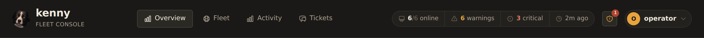
  <figcaption>The header: brand, tab nav, the fleet-metrics pill, and the user menu that holds the global controls.</figcaption>
</figure>

Every view shares one header:

- **Brand** — the kenny mark and the "fleet console" subtitle (top-left).
- **Tab navigation** — **Overview · Fleet · Activity**. The active tab is highlighted.
- **Fleet-metrics pill** — a compact, always-visible summary of the whole fleet:
  **online `x/y`** · **warnings** · **critical** · **last push**. The *warnings* and
  *critical* counts are **section totals** across the fleet (one PC can contribute several),
  and when either is above zero it becomes a **link into the [Flagged view](#the-flagged-view)**.
  On narrow screens the word labels collapse to icon + number.
- **✨ Copilot toggle** *(Fleet tab only)* — show/hide the chat rail (see
  [The copilot](#the-copilot-chat-rail)).
- **User menu** — your avatar (a selectable dog-breed image, or your initials when none is
  set) and username, top-right. Clicking it opens a dropdown that collects the global
  controls:
    - **Profile** and **Users** (superuser only) — see [Accounts & roles](#accounts-roles-the-user-menu).
    - **Light mode / Dark mode** — the theme toggle; switches dark ↔ light in place (the menu
      stays open, and the item names the theme it switches *to*). The choice is saved in
      `localStorage` and applied before first paint (no flash); charts repaint from the cached
      data on toggle.
    - **Settings** *(superuser only)* — opens the [`#/settings`](#accounts-roles-the-user-menu)
      config panel.
    - **About** — opens the [About box](#the-about-box).
    - **Documentation** — opens the project's docs site (this GitHub Pages site) in a new tab.
    - **Log out** (`/logout`).

---

## Accounts & roles (the user menu)

kenny is multi-user (ADR-0037). On first run the console shows a one-time **setup** page;
the first account you create becomes the **superuser**. After that, three roles gate what
each surface shows:

- **Superuser** — everything, including user management and core **Settings**.
- **Operator** — the whole fleet (all hosts, all fleet operations) but *not* user
  management and *not* Settings.
- **User** — only the hosts assigned to them: they see and can operate on those hosts, but
  cannot remove a host from inventory, and never see Settings or fleet-wide admin controls.

**Profile** (all roles) lets you set your email, pick an avatar from the dog-breed grid,
change your password, enable/disable **two-factor (TOTP)** (scan the shown `otpauth://`
secret into an authenticator, then confirm a code), and mint/revoke **personal access
tokens** — the Bearer tokens Claude uses to reach `/mcp` as you (shown once at creation).

**Users** (superuser only) lists every account and lets you create, edit (role, email,
avatar, enable/disable), delete, reset a password, reset 2FA, assign the host scope for a
`user`-role account, and manage that user's access tokens.

Existing single-token installs keep working across the upgrade: the legacy
`KENNY_OPERATOR_TOKEN` is still accepted as a back-compat superuser while you create real
accounts.

---

## The Overview tab

The landing view: a high-level, fully drill-down-able dashboard built from the **latest**
snapshot of every agent. **Every** segment, bar, node, cell, and KPI is clickable and opens
a table of the hosts behind that figure (see [Drill-downs](#drill-downs)).

<figure markdown>
  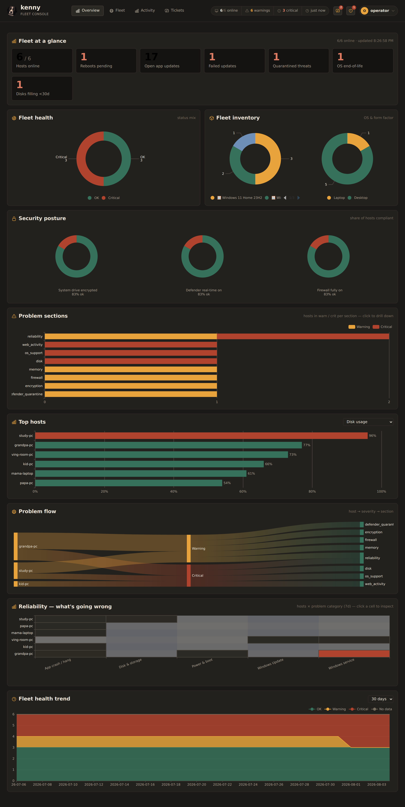
  <figcaption>The Overview tab: KPIs, health & inventory, security posture, problem sections, top hosts, problem flow, the reliability heatmap, and the fleet health trend.</figcaption>
</figure>

### Fleet at a glance (KPI tiles)

Seven actionable totals, each a single number no chart shows on its own:

| KPI | What it counts |
|-----|----------------|
| **Hosts online** | agents currently connected, out of the total known |
| **Reboots pending** | hosts with a pending reboot |
| **Open app updates** | total `winget`/app upgrades available across the fleet |
| **Failed updates** | Windows Updates that failed in the last 30 days |
| **Quarantined threats** | items in Defender quarantine |
| **OS end-of-life** | hosts on an EOL / soon-EOL Windows build |
| **Disks filling <30d** | volumes forecast to fill within 30 days |

Tiles with a non-zero "attention" value (reboots, failed updates, quarantine, EOL, disk
forecast) render in the critical colour. Click any non-empty tile for the host list behind it.

### Fleet health · Fleet inventory

- **Fleet health** — a donut of the fleet's rolled-up **status mix** (OK / Warning /
  Critical / No data). Click a segment to list those hosts.
- **Fleet inventory** — two donuts side by side: **OS** (which Windows versions make up the
  fleet, from `os_support`) and **device** (laptop vs desktop, inferred from whether a
  `battery` section is present).

### Security posture

Three small-multiple donuts showing the **share of hosts compliant** for three controls, each
with a "% ok" caption:

- **System drive encrypted** (BitLocker on the C: volume),
- **Defender real-time on**,
- **Firewall fully on** (all profiles enabled).

Click any slice (OK / Not OK / Unknown) to list the hosts.

### Problem sections

A horizontal stacked bar per telemetry section, split **Warning** vs **Critical**, showing how
many hosts are flagged in each section — worst at the top. Click a bar segment to drill into
those hosts. This answers "*which kind of problem is most widespread right now?*"

### Top hosts

A ranked bar chart with a **metric selector** (top-right): **Disk usage · Memory usage ·
Recent crashes (7d) · Uptime · Pending app updates**. Disk and memory bars are colour-coded by
threshold (green / amber / red). Click the chart title area for the full ranking as a table.

### Problem flow (Sankey)

A flow diagram: **host → severity (Warning/Critical) → responsible section**. The width of each
link is the number of flagged sections. Click a **link** to see the host/section pairs behind
it, or a **node** to see everything touching that host or section. This is the fastest way to
read "*this PC is critical because of these two sections*" at a glance.

### Reliability — what's going wrong

A heatmap of **hosts × friendly problem category** over the last 7 days; each cell's colour is
the event count. Categories come from the server-side reliability categorizer
(App crash / hang, Disk & storage, Power & boot, …; see
[Telemetry reference](telemetry.md#reliability-categorization)). Click a cell to inspect the
loudest sources behind it.

### Fleet health trend

A stacked-area time series of daily fleet status counts, with a **7 / 30 / 90 days** selector.
Click a day/status band to list the hosts that were in that state that day.

### Drill-downs

<figure markdown>
  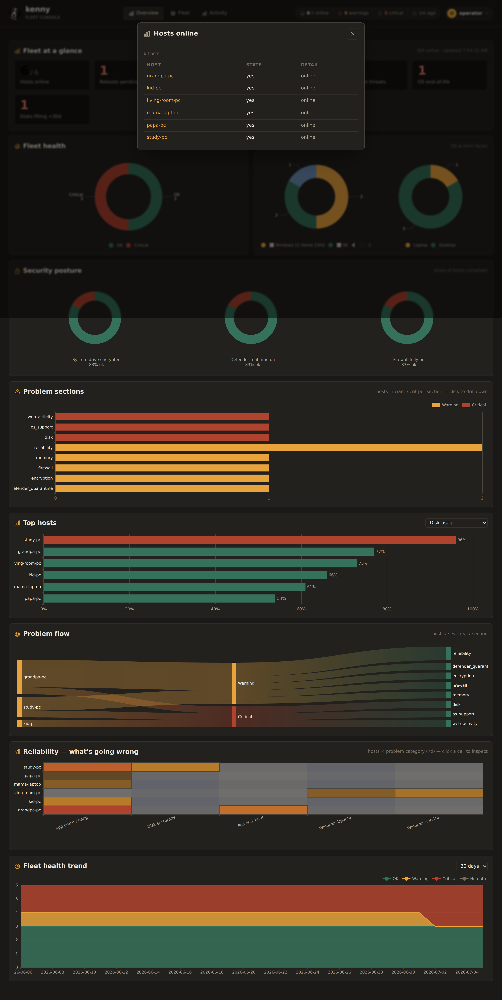
  <figcaption>Any aggregate opens a table of the contributing hosts; click a host to jump straight to it on the Fleet tab.</figcaption>
</figure>

Every Overview widget shares the same drill-down popup — a table of the underlying hosts, each
with the value and a one-line detail. Click a host id to jump to its
[agent detail](#agent-detail-centre) on the Fleet tab.

---

## The Fleet tab

The working view: a three-column console — the **fleet list**, the selected PC's **agent
detail**, and the docked **copilot** chat rail.

<figure markdown>
  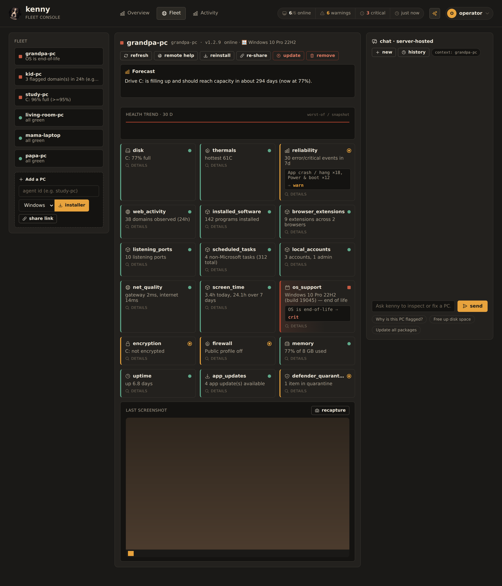
  <figcaption>The Fleet tab: the fleet list (left), the selected agent's drill-down (centre), and the copilot rail (right).</figcaption>
</figure>

### Fleet list (left)

Each PC is a tile with a **status dot**, its hostname, and a one-line summary (the worst
section's reason). Tiles are sorted worst-first; offline PCs carry an **offline** badge and a
critical PC is outlined in red. Click a tile to select it.

Below the list, the **Add a PC** panel onboards a *new* machine: type an agent id, pick the
target **OS** (Windows or Linux), then **installer** / **share link**. For **Windows** these are a
downloadable ZIP or a one-time, expiring link the target user can open without your login. For
**Linux** the panel produces a **one-line install command** (`curl -fsSL … | sudo sh`) in a
copyable modal — the Docker/K3s convenience-script model (ADR-0038). See
[Adding & updating PCs](#adding-updating-pcs).

### Agent detail (centre)

<figure markdown>
  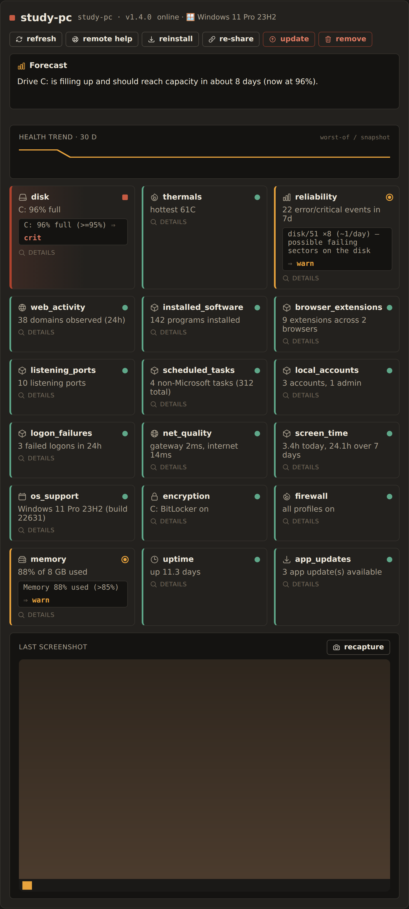
  <figcaption>The per-agent drill-down: action buttons, the AI forecast, the health-trend sparkline, every telemetry section as a tile, and the last screenshot.</figcaption>
</figure>

The header line shows the status dot, hostname, agent id, version, and online/OS. Then:

- **Action buttons** — **refresh** (force a fresh telemetry collect), **remote help** (open
  Quick Assist on the PC), **reinstall** (rebuild this PC's installer, rotating its token),
  **re-share** (a fresh one-time link for this PC), and **update** (push a self-update). The
  destructive ones confirm first.
- **AI Forecast** — a short, plain-English outlook pinned at the top: what is likely to need
  attention on this PC soon, synthesized from the disk-fill and battery trends and the
  inventory changes since yesterday (e.g. "*Drive C: is filling up and should reach capacity
  in about 16 days; one new admin account appeared overnight.*"). With an Anthropic API key
  it is generated by the model and marked with a ✦; without a key the same card shows a
  concise deterministic summary of the same signals. See [Alerting & forecasts](alerting.md).
- **Health trend · 30 d** — a sparkline of the PC's worst-of health per snapshot.
- **Section tiles** — one tile per telemetry section: icon, name, status dot, a one-line
  summary, and — when flagged — the server's **rule reason** as a `reason ⇒ status` chip.
  Click a tile to open its [section detail](#section-detail-popups). Sections a collector
  can't report on the host OS (their summary reads *n/a on this platform*, e.g. the
  Windows-only sections on a Linux host) carry no signal and are hidden from the grid;
  they are still stored and remain reachable via the API.
- **Last screenshot** — the most recent desktop capture, with a **recapture** button; click
  the image to enlarge it.

<figure markdown>
  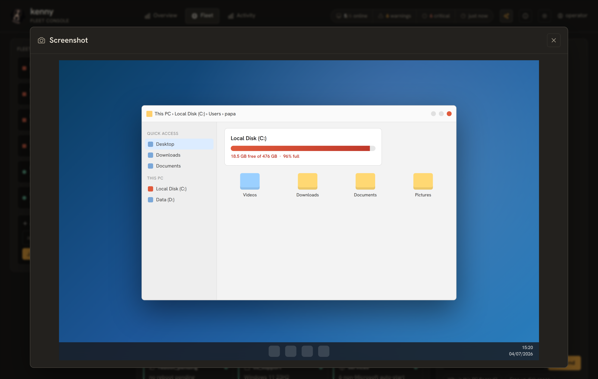
  <figcaption>Clicking the thumbnail opens the screenshot near-fullscreen. Screenshots are captured in the user's session by the tray helper.</figcaption>
</figure>

### Section detail popups

Clicking a section tile opens a structured popup — never raw JSON. Scalars become a
definition list, arrays of objects become tables (long tables get a filter box), and nested
objects become sub-lists. The header carries the section's status pill and, when flagged, the
rule-reason chip.

<figure markdown>
  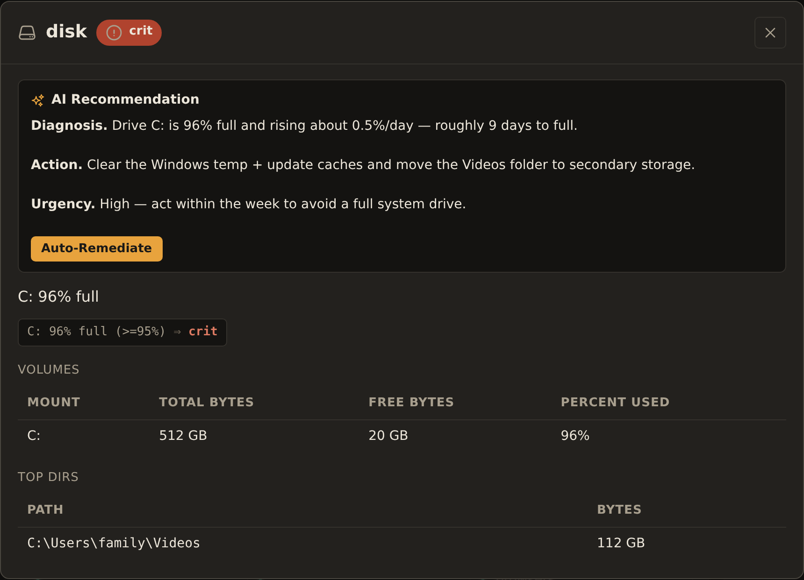
  <figcaption>The disk section detail: an AI Recommendation (Diagnosis / Action / Urgency) with an Auto-Remediate button above the structured volumes and top-directories tables.</figcaption>
</figure>

- **AI Recommendation** — for a flagged section, when an Anthropic API key is configured, a
  short **Diagnosis / Action / Urgency** advisory streams in at the top. If the advisor judges
  the issue fixable with kenny's tools it adds an **Auto-Remediate** button that hands a
  suggested prompt to the copilot (state-changing steps still hit the confirm-gate). See
  [ADR-0019](adr/0019-ai-recommendations-and-auto-remediation.md).
- **Reliability** has a custom renderer — a category × day heatmap plus expandable event groups:

  <figure markdown>
    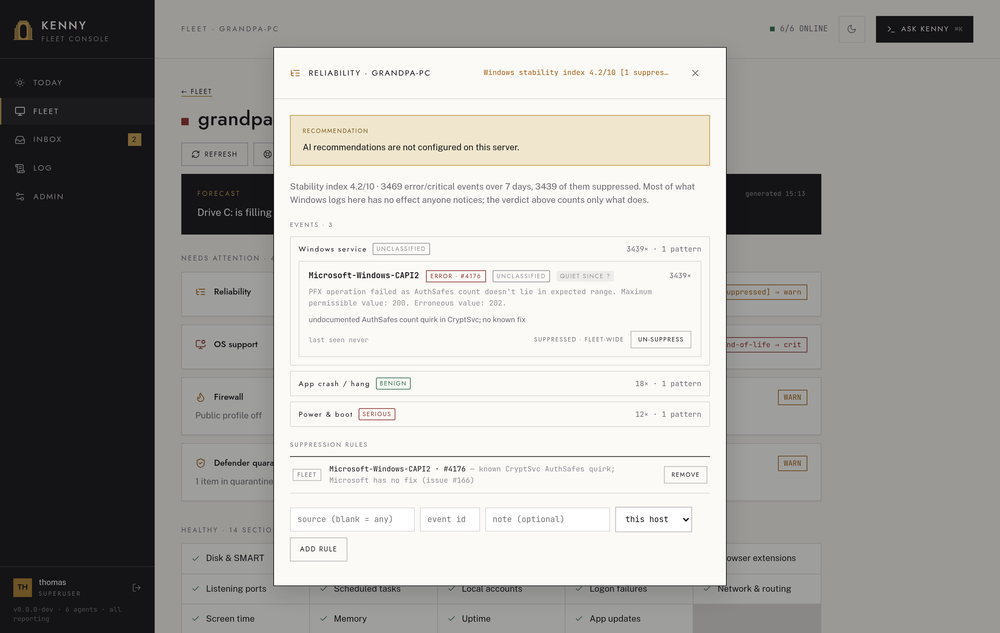
    <figcaption>Reliability: what is going wrong, as a category×day heatmap, with each category expanding to the raw sources, event ids, and sample messages.</figcaption>
  </figure>

- **Web activity** has the **parental-controls list editor** (toggles, custom domains,
  apply/drift); see [Parental controls](parental-controls.md).

  <figure markdown>
    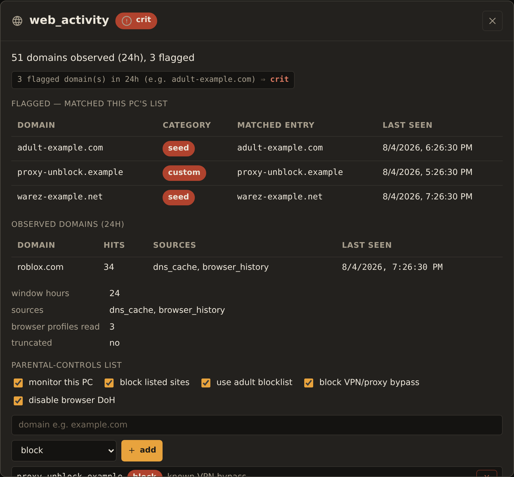
    <figcaption>web_activity: flagged domains, observed domains, and the per-host parental-controls list editor.</figcaption>
  </figure>

- **Screen time** renders whole-machine interactive minutes per day as simple bars.

### The copilot (chat rail)

<figure markdown>
  
  <figcaption>The copilot: an assistant reply, an auto-run read-only tool, and the amber confirm-gate pausing a state-changing winget_update until the operator approves.</figcaption>
</figure>

The **server-hosted Claude** chat, docked on the right. No local client needed — ask in plain
language and Claude picks and runs kenny's tools.

- **Context chip** — shows whether the chat is scoped to the **selected PC** or the whole
  **fleet**; it mirrors your fleet selection automatically.
- **new** starts a fresh conversation; **history** browses saved ones (below).
- **Transcript** — user and assistant bubbles (assistant text is rendered markdown),
  **tool-run chips** (with an `auto-run` tag for read-only calls), inline screenshots, and the
  **confirm-gate**.
- **Confirm-gate** — read-only tools run automatically; any **state-changing** tool pauses in
  an amber card showing the exact tool + arguments, with **confirm & run** / **cancel**. The
  composer is locked until you resolve it. See
  [Tool reference](tools.md#the-confirm-gate-who-enforces-what).
- **Composer** — type and **send**; while a turn streams the button becomes **stop**.
  Suggestion chips ("Why is this PC flagged?", "Free up disk space", "Update all packages")
  pre-fill the box.

**Chat history** — every conversation is persisted; browse, resume, or delete past ones:

<figure markdown>
  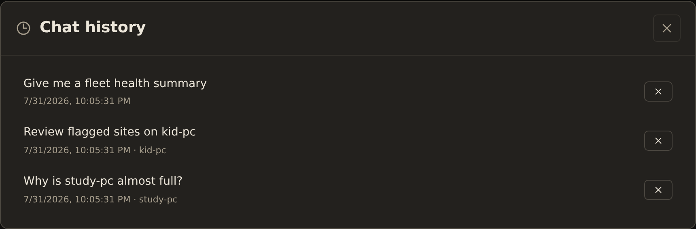
  <figcaption>Saved conversations, titled from the first message and tagged with the PC they were scoped to.</figcaption>
</figure>

On desktop the rail is a docked column you can hide with the header **✨** button (persisted);
below ~1180 px it becomes an overlay drawer that slides in over a backdrop (Escape or a
backdrop click closes it).

---

## The Activity tab

Fleet-wide observability, split into two sub-views (left nav): the **tool-call audit log** and
**events & logs**.

### Tool-call audit log

<figure markdown>
  
  <figcaption>Every forwarded capability call, tagged read-only or state-changing, with its result.</figcaption>
</figure>

Every forwarded capability call, newest first: time, **ok/err**, tool, **read-only vs
state-changing**, and the target PC. The search box (with autocomplete over tools, PCs, and
times) filters live, and the list is paged.

### Events & logs

<figure markdown>
  
  <figcaption>Server and agent log lines, emitted alerts, and audit events in one searchable, paged stream.</figcaption>
</figure>

A unified stream of server + agent **log lines**, emitted **alerts**, and audit events: time,
level (error/warn/info/debug), source, the PC (if any), and the message. Searchable by level,
source, PC, or message, and paged. This is where [alerts](alerting.md) land as an audit trail.

---

## The Flagged view

<figure markdown>
  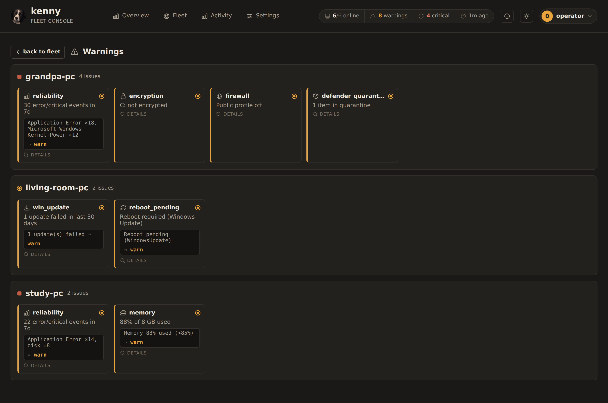
  <figcaption>Everything needing attention, grouped by PC — reached from the header warnings/critical pills.</figcaption>
</figure>

Reached by clicking the **warnings** or **critical** count in the header. It lists every
flagged section of that severity, **grouped by PC** (busiest first). Each tile opens that
section's detail **in place** — no navigation away — so you can triage the whole fleet without
losing your spot. **Back to fleet** returns to the Fleet tab.

---

## Adding & updating PCs

<figure markdown>
  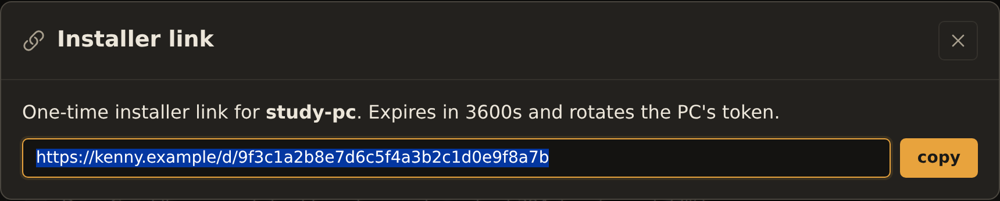
  <figcaption>A one-time installer link for a PC, with a copy button; it expires and rotates the PC's token.</figcaption>
</figure>

- **Add a PC** (Fleet list) onboards a *new* machine. Pick the target **OS** first.
  On **Windows**, **installer** downloads a ZIP (the agent binary + a pre-filled `setup.bat` +
  a freshly minted token) and **share link** produces a one-time, expiring link the target user
  opens without your login. On **Linux**, both produce the **one-line install command**
  (`curl -fsSL … | sudo sh`) — a nonce-gated, single-use script carrying the same freshly minted
  one-time enrollment token (ADR-0038).
- On an existing PC, **reinstall** / **re-share** re-provision *that* agent id (rotating its
  token, so the old install stops reporting) — a ZIP/link on Windows, the one-line command on
  Linux — and **update** pushes a server-triggered self-update. **Update works on both Windows
  and Linux**: the agent downloads the new binary, verifies its SHA-256, swaps it in place, and
  restarts its service (systemd on Linux, the Windows service on Windows).
- **Remove** (operator/superuser only, on the agent drill-down) takes a host out of
  inventory: it purges that agent's snapshots, events, tokens, keys, web-filter state, and
  scope assignments. A host still pinned via `KENNY_AGENT_TOKENS` is refused (it would just
  re-appear on the next restart). The provisioning/reinstall actions above are gated to
  operator+ too; a scoped `user` sees only refresh and remote-help on its assigned hosts.

The full onboarding and update flows (with sequence diagrams) are in the
**[User guide](user-guide.md#adding-a-pc-to-the-fleet)**.

---

## The About box

<figure markdown>
  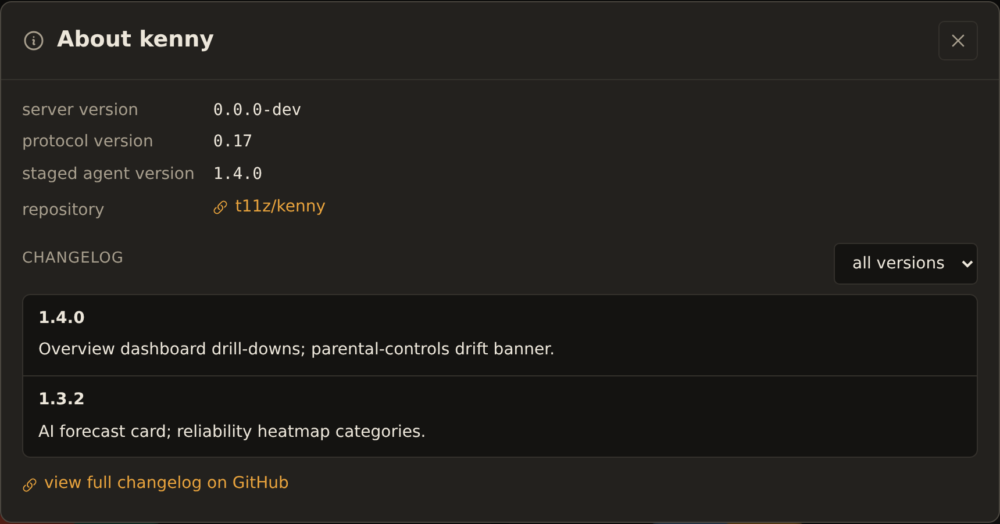
  <figcaption>Server, protocol, and staged-agent versions, the repository link, and a filterable changelog pulled from GitHub Releases.</figcaption>
</figure>

The **About** item in the [user menu](#the-shell-header-global-controls) shows the
**server version**, **protocol version**, **staged agent version**, and a link to the
repository, plus a live **changelog** filtered from the project's GitHub Releases (filter
by version, or view the full list on GitHub).

---

## Themes, deep links & accessibility

- **Dark & light** — the warm "border-collie" dark theme is the default; the toggle lives in
  the [user menu](#the-shell-header-global-controls), is persisted, and is applied before
  first paint.

<figure markdown>
  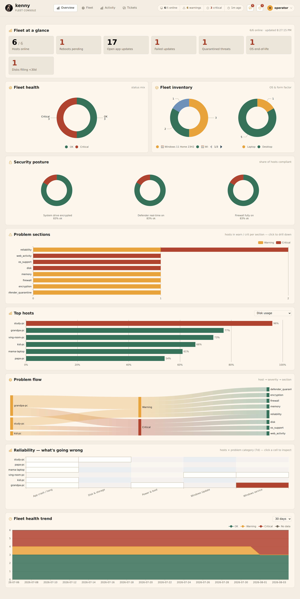
  <figcaption>The same Overview in the light theme — the charts repaint from cached data on toggle.</figcaption>
</figure>

- **Status is never colour-only** — each status has a distinct **shape + icon + label**
  (OK = ● check, Warning = ◍ triangle, Critical = ■ octagon, Unknown = dashed ○), so the
  console is legible without colour.
- **Deep links** — every view is a URL hash you can bookmark or share (`#/overview`,
  `#/fleet`, `#/activity/audit`, `#/activity/events`, `#/flagged/warn`, `#/flagged/crit`).
- **Keyboard & motion** — Escape closes modals and the copilot drawer; animations respect
  `prefers-reduced-motion`.

---

## See also

- **[User guide](user-guide.md)** — the common operator workflows.
- **[Telemetry reference](telemetry.md)** — every section and its health rule.
- **[Tool reference](tools.md)** — the capability and orchestration tools.
- **[Parental controls](parental-controls.md)** · **[Alerting & digests](alerting.md)**.
