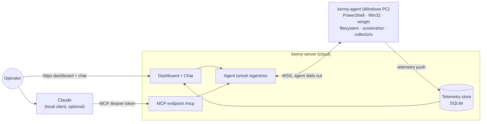

# 🐕 kenny

**Self-hosted remote administration _and fleet monitoring_ for Windows PCs, driven by
Claude (MCP) and a web dashboard.**

kenny started as a way to look after the family's Windows PCs — keep an eye on disk space and
Defender, fix things over the phone without "can you read me what it says" — operated through
Claude instead of a clunky console. It works for any small fleet you administer with consent.

- **kenny-server** (Python / FastMCP) — MCP endpoint for Claude, the agent tunnel, the
  telemetry store (SQLite), and the operator dashboard. One ASGI app, one port.
- **kenny-agent** (Rust, single binary) — runs on each Windows PC, dials **out** to the server
  (NAT/firewall friendly), executes tool calls in the user's session, and pushes health snapshots.

## Where to next

- :material-rocket-launch: **[Setup & operations](setup.md)** — host the server, configure TLS
  and environment, build & distribute the agent.
- :material-book-open-variant: **[User guide](user-guide.md)** — operator workflows: dashboard,
  chat, running tools, onboarding and updating agents.
- :material-file-document-outline: **[Wire protocol](protocol.md)** — the agent⇄server contract
  (single source of truth, round-tripped by both sides).
- :material-sitemap: **[Architecture decisions](adr/README.md)** — MADR records for every significant choice.

## Contributing

kenny is open source under **[AGPL-3.0-only](https://github.com/t11z/kenny/blob/main/LICENSE)**.
See **[CONTRIBUTING](https://github.com/t11z/kenny/blob/main/CONTRIBUTING.md)**,
the **[Code of Conduct](https://github.com/t11z/kenny/blob/main/CODE_OF_CONDUCT.md)**, and the
**[Security policy](https://github.com/t11z/kenny/blob/main/SECURITY.md)** (report
vulnerabilities privately). Questions and ideas go to
**[Discussions](https://github.com/t11z/kenny/discussions)**.
