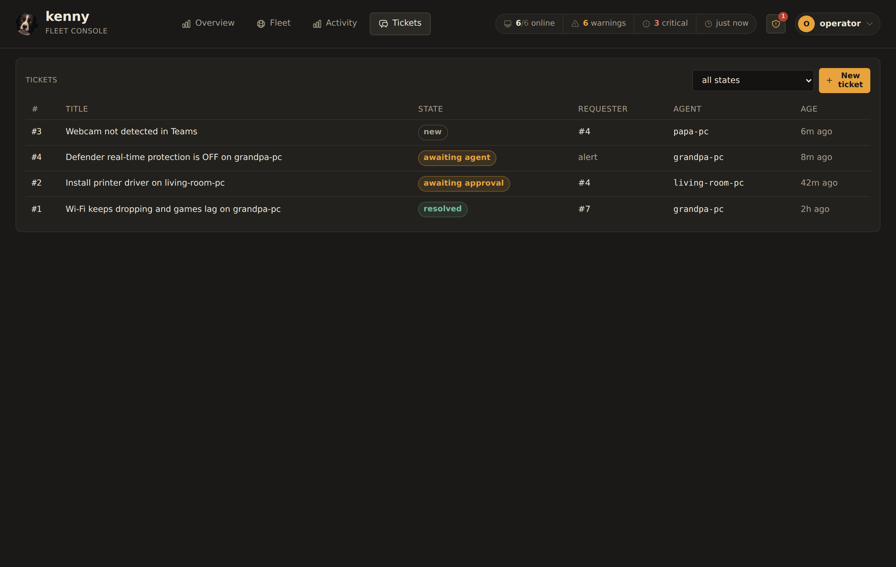
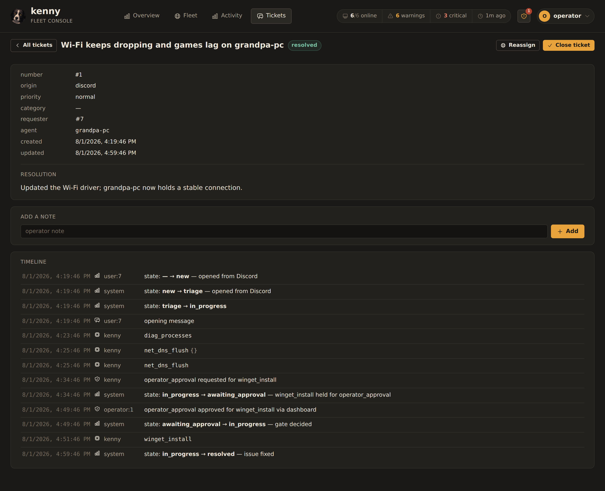
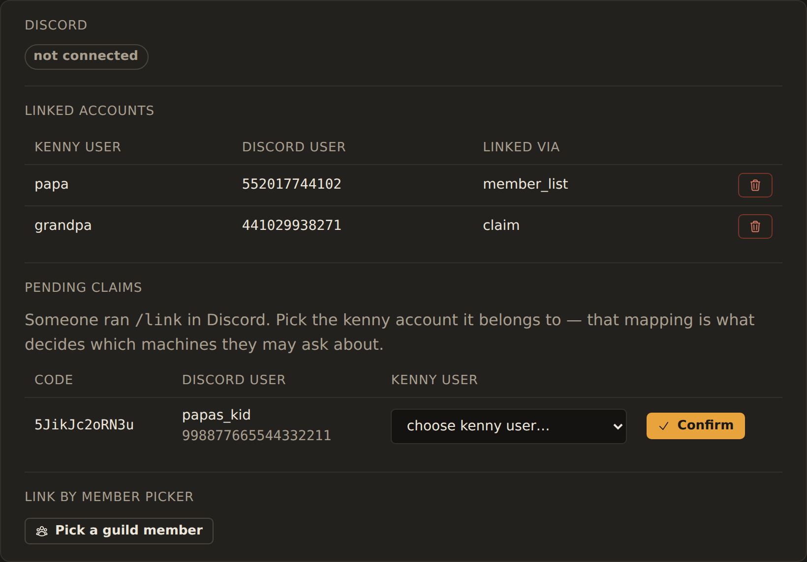

# Tickets & the Discord bot

kenny has a **Discord bot** you can add to your family's server. A family member mentions
it, kenny opens a private thread and works the problem right there — diagnosing on that
person's own PC, running the safe stuff itself, and asking you when something needs your
say-so. Every thread is also a **ticket**: a record you can read, search and act on from
the dashboard, whether it came from Discord, from you, or from an alert.

This page is the operator's guide to running that surface: what a ticket is, what kenny
may do without asking, how the two enrollment paths work, and the Discord application
setup you have to do yourself. **Why it is built this way — the trust model, the four
controls that make handing tool-use to a family member's chat message defensible — is
covered in the ADRs**, linked throughout; this page is about running it, not justifying it.

!!! warning "Consent and scope"
    This is for machines **you** administer, in a family setting, with the knowledge and
    consent of the people who use them. A Discord account only ever reaches the PCs *you*
    assign to the kenny account it is linked to — see
    [Enrollment: linking a Discord account](#enrollment-linking-a-discord-account) below.

## What a ticket is, and where it comes from

A ticket is one support conversation: a title, a state, the one PC it is about, a running
paraphrase of what happened, and a machine-readable trail of every message, tool call,
approval and state change underneath it. Three things can open one:

- **A Discord mention.** Someone `@kenny`s the bot in the support channel (or runs
  `/kenny help-me`), kenny opens a private thread for it, and the ticket is born already
  pointed at that person's PC.
- **The dashboard.** Any signed-in account — including a scoped `user` — can open a ticket
  with **New ticket** on the [Tickets tab](dashboard.md). This is the same record type, it
  just starts without a Discord thread attached.
- **An alert.** A genuine alert (not a recovery, not the digest) can open its own ticket
  automatically, so a Defender-disabled or a failing-disk notification arrives with
  somewhere to work it, not just a push you have to remember. An alert-origin ticket has no
  requester — it belongs to the fleet, not a person — so only an operator can see or drive it.

<figure markdown>
  
  <figcaption>The Tickets tab: every ticket you can see, filterable by state — an operator+ sees the whole queue, a scoped user only ever their own.</figcaption>
</figure>

Every ticket is pinned to **exactly one PC**, decided the moment it is created and never
moved by anything the requester or the assistant says afterward — only an operator can
**reassign** it, from the dashboard. That is deliberate: a ticket that could be quietly
retargeted mid-conversation would undercut every other guarantee on this page. See
[ADR-0050](adr/0050-ticket-as-entity-chat-thread-as-binding.md) for why the ticket, not the
chat thread, is the thing that actually exists.

## The lifecycle, in plain language

A ticket moves through a small set of states. You will see all of them as pills in the
list and the detail view:

| State | Meaning |
|---|---|
| `new` | Just created, nothing has happened yet. |
| `triage` | Kenny has picked it up and is about to start. |
| `in_progress` | Kenny (or you) is actively working it. |
| `awaiting_user` | Kenny is waiting on a reply from the person it belongs to. |
| `awaiting_approval` | A step needs **your** sign-off before it can continue. |
| `awaiting_agent` | Kenny has done what it can on its own and is waiting on an operator to pick it up (including once it hits its per-ticket turn limit). |
| `resolved` | The problem is fixed. Still reopenable. |
| `closed` | Done. **Terminal** — reopening creates a new ticket that references the old one. |
| `cancelled` | Withdrawn, by the requester or an operator. **Terminal.** |

A `resolved` ticket auto-closes after a while if nobody touches it (`KENNY_TICKET_AUTOCLOSE_SECS`,
default 2 days) — a housekeeping sweep that runs alongside the alert and backup loops, not
anything the requester has to do.

<figure markdown>
  
  <figcaption>Ticket detail: the summary/resolution, and the timeline — messages, autonomous tool calls, a held approval, its decision, and the resolution, in order.</figcaption>
</figure>

## What kenny may do on its own, and what waits for you

Every tool kenny can call is one of three tiers — see [Tool reference](tools.md) for the
full breakdown. On the Discord surface specifically:

- **Read-only** tools (looking at telemetry, listing processes, checking service status)
  run immediately.
- **Standard changes** — routine, reversible, low-blast-radius steps like flushing DNS or
  opening a remote-help session — run **autonomously**, with a trail row recording that
  they ran and why they were allowed to.
- **Normal changes** — everything else that changes state: running a shell command,
  installing or removing software, touching who may sign in to a PC — **always stop and
  wait for an operator**, no matter who is asking or what PC it is on.

This is a **property of the Discord surface**, not of the tools themselves — the same
tiers exist in the dashboard chat, which still confirms *both* change tiers exactly as it
always has. See [Tool reference § the confirm-gate](tools.md#three-tiers-and-who-enforces-what)
for the surface-by-surface table, and
[ADR-0049](adr/0049-tiered-tool-classification.md) for why the tier and the gate are kept
apart on purpose.

When a step needs you, kenny posts an **approval card** — in the operator channel if you
configured one, otherwise in the ticket's own thread — with the exact tool and arguments,
and the header's **approvals badge** (a shield icon next to the copilot toggle, with a
count) opens the same queue from anywhere in the dashboard. Approvals are **persistent**:
they survive a server restart, and they expire after `KENNY_TICKET_APPROVAL_TTL_SECS`
(default 24 h) — an expiry counts as a denial, and kenny tells the requester so. See
[`dashboard.md`](dashboard.md#the-approvals-badge) for the badge and its confirm dialog.

## Operator approval vs. user consent — two different questions

A held step can be waiting on one of two different things, and they are not
interchangeable:

- **Operator approval** asks *"should the fleet change this way?"* — the security
  question. Only **you** (operator or superuser) can grant it, and the requester can never
  approve their own ticket's step, however routine it looks.
- **User consent** asks *"may kenny look at this person's screen, files, or browsing?"* —
  the privacy question, for `screen_capture`, `remotehelp_start`, `fs_read` and
  `web_activity_query`. Only the **ticket's requester** — the person it actually concerns —
  can grant it. **You cannot grant it on their behalf, even as the operator**: consent for
  someone else's privacy is not yours to give, and kenny refuses the attempt the same way
  it refuses a requester approving their own change.

If a single tool call needs both (opening remote help is a `standard_change` *and*
privacy-sensitive), consent is asked first; once it is answered, the call re-enters the
gate and — if it also needs an operator — asks for that next. A ticket only ever has **one**
open ask at a time. See [ADR-0051](adr/0051-capability-profiles.md) for consent as an axis
separate from authorization.

## Enrollment: linking a Discord account

kenny only ever acts as the **kenny account** a Discord snowflake is mapped to — never
from a display name, never from a Discord role. **That mapping is what decides whose
machines a person may ask about**, so it is worth getting right. There are two ways to
create it, both landing in the same table and both logged:

**A — the person links themselves.** They run `/kenny link` in Discord. Kenny opens a
short-lived claim and hands back a code; you confirm it in **Settings → Discord →
Pending claims**, picking which kenny account it belongs to. The claim expires on its own
if nobody confirms it.

**B — you link them directly.** In **Settings → Discord**, **Pick a guild member** lists
everyone in the server (this needs the **Guild Members** intent — see below) and lets you
bind one straight to a kenny account, no code required.

<figure markdown>
  
  <figcaption>Settings → Discord: connection status, linked accounts, pending claims, and the guild-member picker.</figcaption>
</figure>

Either way, the person can check what kenny thinks of them with `/kenny whoami` — their
kenny account, role, capability profile, and which PCs it can see. That command exists
specifically so a mis-mapping is visible to the person it affects, not silent.

An account can be **unlinked** at any time (Settings → Discord → the trash icon on a
linked row); a disabled/removed mapping makes that Discord user completely inert again —
no ticket, no reply, no model call, exactly as if they had never linked.

## Capability profiles

A **capability profile** is a named, per-account tool allowlist — it only ever *narrows*
what an account's role would otherwise allow, never widens it. Set it per user in
**Users → (a user) → Capability profile**.

| Profile | Roughly |
|---|---|
| `self-service-basic` | Diagnose your own PC, plus the standard changes (flush DNS, open remote help). No shell, no file reads, no browsing history, no account changes. |
| `power-user` | Also files, event log, screen captures, and package install/uninstall/update. Still no shell, no agent updates, no account governance. |
| `operator` | Unrestricted — today's behavior. |
| *(none set)* | Role default — the profile column is nullable on purpose. |

A profile applies everywhere that account acts — Discord and MCP alike — and it is
checked **twice**: the disallowed tool is not even offered to the model, and dispatch
refuses it again if it somehow got called anyway. See
[ADR-0051](adr/0051-capability-profiles.md) for why this is a profile column rather than a
fourth role.

## What is recorded, and what is not

Every ticket keeps two things: a **paraphrase** — the running summary and resolution you
read in the dashboard — and a **machine-readable event trail**: every message, tool call
(with its arguments), approval, consent and state change, in order, timestamped and
attributed. That trail is what the [ticket detail timeline](#the-lifecycle-in-plain-language)
shows you, and it is never pruned.

The **raw transcript** — the verbatim back-and-forth kenny needs only to resume a ticket
after a restart — is working state, not the record. It is pruned after
`KENNY_TICKET_RETENTION_DAYS` (default 30 days) once a ticket is closed. Nothing about the
ticket, its summary, or its audit trail depends on the transcript still existing; deleting
it loses nothing you would ever need to read back.

Screenshots, file contents, event-log text and browsing history **never leave the server
toward Discord** — kenny summarises what it found in plain language and links to the
ticket in the authenticated dashboard for the detail. Discord threads are private (invite
the requester only) and slash commands answer ephemerally, but the output-redaction rule
holds regardless of thread privacy.

## Setting up the Discord application

The bot needs its own Discord application — kenny cannot use Discord's own assistant
("Clyde" was retired at the end of 2024), and there is no shared kenny bot to add. This
part is on you, once, in the [Discord Developer Portal](https://discord.com/developers/applications):

### 1. Create the application and its bot

**Applications → New Application**, name it (this name and its avatar are what the family
sees — "kenny" and the dog mark keep it recognisable), then open the **Bot** tab and add a
bot.

While you are on that tab, turn **Public Bot** off unless you have a reason not to. It only
controls whether *other people* can invite your bot; leaving it on does not grant anyone
access to your server, but there is no reason to advertise it.

### 2. The token

**Bot → Token → Reset Token**, then copy the value. Discord shows a bot token exactly
once — there is no "reveal" later, so if you lose it you reset it again, and resetting
immediately invalidates the previous one.

Put it in `KENNY_DISCORD_BOT_TOKEN`. This one is **environment-only**: it is never written
to kenny's database and never editable in the Settings UI, so rotating it means changing
the environment and restarting. A leaked bot token lets anyone act as your bot in your
server — treat it like the operator token.

### 3. Privileged intents

Still on the **Bot** tab, under **Privileged Gateway Intents**:

| Intent | Needed for | If missing |
|---|---|---|
| **Message Content** | **Required.** Reading what someone actually wrote. | Mentions arrive with **empty content**. kenny cannot tell what was asked and the bot looks dead. This exact symptom is detected and reported once in the operator channel and in `/api/discord/status`, so it does not read as a silent hang. |
| **Server Members** | The guild-member picker (enrollment path B). | The picker returns an empty list with a warning; enrollment path A (`/kenny link`) still works. |
| Presence | nothing — leave it off. | — |

kenny asks for no other intent. Under 100 servers these are toggles; above that Discord
requires verification, which a household install will never reach.

### 4. Bot permissions and the invite

Use **OAuth2 → URL Generator** rather than writing the URL by hand — it computes the
permission bits for you.

**Scopes:** `bot` **and** `applications.commands`. The second one is easy to forget and is
what allows the slash commands to be registered; without it the bot joins and the
`/kenny …` commands never appear.

**Bot permissions** — check exactly these:

| Permission | Why |
|---|---|
| View Channels | See the support and operator channels at all |
| Send Messages | Reply, and post approval cards |
| Send Messages in Threads | Everything after a ticket is opened happens in a thread |
| Create Private Threads | A ticket thread is private by default (`KENNY_DISCORD_PRIVATE_THREADS`) |
| Manage Threads | Archive and lock a thread when its ticket closes |
| Read Message History | Read the thread it is working in |
| Embed Links | Approval cards are embeds |

Nothing else. kenny never posts files or images to Discord — screenshots, file contents and
event-log text are deliberately kept on the server — so it needs no attachment permission,
and it never moderates, so it needs no kick, ban or role permission. If you are tempted to
grant Administrator to "make it work", don't: it will not fix a missing intent, which is the
usual real cause.

Open the generated URL, pick your server, and authorise.

**Channel overwrites can still block it.** Server-level permissions are not the whole story
— if the support or operator channel has its own permission overwrites, add the bot's role
there too. A bot that can see the server but not the channel behaves exactly like one that
was never invited.

### 5. Point kenny at the right places

Turn on **User Settings → Advanced → Developer Mode**, then right-click a server or channel
and **Copy ID** to get the snowflakes for:

- **`KENNY_DISCORD_GUILD_IDS`** — the server(s) kenny may react in. **This is a hard
  allowlist and an empty one denies everywhere**; there is no allow-all mode, on purpose. An
  event from any other guild is dropped before anything else happens, including before the
  author is looked up.
- **`KENNY_DISCORD_SUPPORT_CHANNEL_ID`** — where a mention opens a ticket.
- **`KENNY_DISCORD_OPERATOR_CHANNEL_ID`** — where approval cards go (the ticket thread
  otherwise).

Restrict the operator channel to yourself as good hygiene — but understand what that is and
is not. Deciding an approval requires the kenny `operator` role either way; channel
visibility governs who *sees* the card, not who may act on it. Discord roles are never read
as authorization ([ADR-0048](adr/0048-delegated-identity-from-a-chat-platform.md)), so this
is defence in depth, not the control.

### 6. Switch it on

Set `KENNY_DISCORD_ENABLED=1` and restart. The bot connects on startup; nothing happens
before that, and nothing happens at all without a token.

### Checking it actually worked

**Settings → Discord** shows the gateway status. Three things it will tell you:

- **connected** — the gateway is up.
- **failed to start** with a reason — most often the optional `discord.py` dependency is
  missing from a source install (the published image ships it), or the token is rejected.
- a **Message Content** warning — the intent is off; mentions are arriving empty.

Then mention the bot in the support channel. You should get a private thread. If nothing
happens at all, work down: is the account linked (`/kenny whoami`), is the guild on the
allowlist, can the bot see the channel?

An unmapped Discord account is **completely inert** by design — no thread, no reply, not
even a model call — so "the bot ignores me" is the expected behaviour before enrollment,
not a fault.

A server with no Discord configuration at all still runs the full ticket surface — the
store, the lifecycle, the dashboard's Tickets tab and API all work with nothing pointed at
Discord; only the bot connection itself is opt-in. See [`setup.md`](setup.md) for the
complete environment-variable reference and [ADR-0048](adr/0048-delegated-identity-from-a-chat-platform.md)
for why Discord roles are never read as authorization, however tempting that shortcut looks.

## See also

- [`dashboard.md`](dashboard.md) — the Tickets tab, the approvals badge, and the Discord
  Settings panel, widget by widget.
- [`tools.md`](tools.md) — the three tool tiers and the full confirm-gate table.
- [`alerting.md`](alerting.md) — how an alert opens a ticket, and the Discord webhook
  notification channel.
- [ADR-0048](adr/0048-delegated-identity-from-a-chat-platform.md) — delegated identity,
  no parallel authorization.
- [ADR-0049](adr/0049-tiered-tool-classification.md) — the tier belongs to the tool, the
  gate to the surface.
- [ADR-0050](adr/0050-ticket-as-entity-chat-thread-as-binding.md) — the ticket is the
  entity; the chat thread is a binding.
- [ADR-0051](adr/0051-capability-profiles.md) — capability profiles as a third
  authorization axis.
