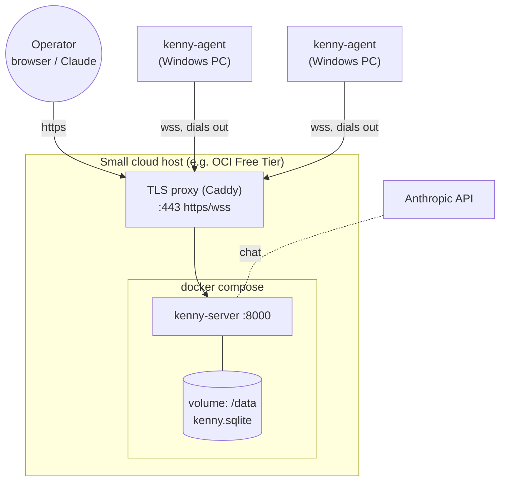
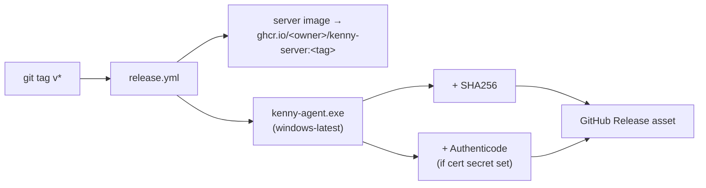

# kenny — Setup & Operations

How to host **kenny-server**, configure it, build and distribute **kenny-agent**, and cut releases.
For day-to-day operator use, see [`user-guide.md`](user-guide.md).

## Topology



## Prerequisites

- A host with Docker + Docker Compose (server), reachable by the agents over TLS.
- A DNS name + TLS for production (the bundled Caddy profile can obtain certs automatically).
- For the dashboard chat: an `ANTHROPIC_API_KEY`.
- To build the agent / cut releases: a GitHub repo with Actions (the workflow targets `windows-latest`).

## Quick start (Docker Compose)

```bash
# from the repo root
KENNY_OPERATOR_TOKEN="$(openssl rand -hex 24)" \
KENNY_AGENT_TOKENS="papa-pc=$(openssl rand -hex 16),oma-laptop=$(openssl rand -hex 16)" \
ANTHROPIC_API_KEY="sk-ant-..." \
docker compose up --build -d
```

The server is now on `http://localhost:8000` (data persists on the `kenny-data` volume). Open `/`,
sign in with the operator token. For TLS in front (port 443, `wss`), enable the Caddy profile:

```bash
KENNY_DOMAIN=kenny.example.com KENNY_OPERATOR_TOKEN=... docker compose --profile tls up -d
```

## Environment variables

| Variable | Used by | Default | Purpose |
|----------|---------|---------|---------|
| `KENNY_OPERATOR_TOKEN` | server | *insecure dev fallback* | Operator bearer token (MCP + `/api` + UI login). **Set this.** |
| `KENNY_OPERATOR_TOKENS` | server | — | Optional comma-separated set of accepted operator tokens (multi-operator). |
| `KENNY_AGENT_TOKENS` | server | dev map | `id=token,id2=token2` — per-agent tokens (the token store is seeded from this). |
| `ANTHROPIC_API_KEY` | server | — | Enables the dashboard chat. |
| `KENNY_CHAT_MODEL` | server | `claude-sonnet-4-6` | Model for the chat loop. |
| `KENNY_TLS` | server | unset | Set `1` behind TLS so the login cookie gets the `Secure` flag. |
| `KENNY_PUBLIC_URL` | server | `http://localhost:<port>` | External base URL; used to build installer/update links and the agent `--server` `wss://…/agent/ws`. |
| `KENNY_AGENT_BINARY` | server | — | Path to the prebuilt `kenny-agent.exe` the server serves for installer download + self-update. Overrides the GitHub auto-fetch when set. |
| `KENNY_GITHUB_TOKEN` | server | — | GitHub token enabling auto-fetch of the agent binary from Releases (ADR-0015). When set (and `KENNY_AGENT_BINARY` is not), the server fetches `kenny-agent.exe` on startup. |
| `KENNY_GITHUB_REPO` | server | `t11z/kenny` | Repo to fetch the agent binary release from. |
| `KENNY_AGENT_BINARY_CACHE` | server | `<dir of KENNY_DB_PATH>/kenny-agent.exe` | Where the auto-fetched binary is cached (the `/data` volume in the container). |
| `KENNY_AGENT_VERSION` | server | `0.2.0` | **Fallback** version label only — the GitHub release tag of the fetched binary leads (ADR-0015). Used when no tag is known (e.g. a manually-placed binary without a `.version` sidecar). |
| `KENNY_HOST` / `KENNY_PORT` | server | `127.0.0.1` / `8000` | Bind address (container sets `0.0.0.0`). |
| `KENNY_DB_PATH` | server | `kenny.sqlite` | SQLite telemetry store (container: `/data/kenny.sqlite`). |
| `KENNY_TELEMETRY_INTERVAL_SECS` | agent / server | `900` | Agent push interval; also pre-filled into generated installers. |

> **Security:** if `KENNY_OPERATOR_TOKEN` is unset the server uses a loud, insecure dev token. Always
> set real tokens and serve over `wss`/`https` for anything non-local. See
> [`adr/0008-operator-authentication.md`](adr/0008-operator-authentication.md) and
> [`adr/0014-auth-hardening.md`](adr/0014-auth-hardening.md).

## Running from source (development)

```bash
# server
cd kenny-server && pip install -e ".[dev]"
KENNY_OPERATOR_TOKEN=dev KENNY_HOST=127.0.0.1 KENNY_PORT=8000 kenny-server

# agent (foreground; Linux builds via cfg fallbacks)
cd kenny-agent && cargo run -- --server ws://127.0.0.1:8000/agent/ws \
  --agent-id dev --token dev-token --telemetry-interval-secs 30
```

`/e2e` runs a real agent↔server smoke test; `/contract-check` verifies both sides match the wire
contract and golden fixtures.

## Enabling agent downloads from the GUI

The server serves a **prebuilt** binary; it does not compile per download (see
[`adr/0012-agent-distribution-prebuilt-binary.md`](adr/0012-agent-distribution-prebuilt-binary.md)). Point it at a binary and set the
public URL:

```yaml
# compose.yaml (server service) — excerpt
environment:
  KENNY_PUBLIC_URL: https://kenny.example.com
  KENNY_AGENT_BINARY: /data/kenny-agent.exe   # mount/copy the release artifact here
  KENNY_AGENT_VERSION: "0.2.0"
```

Then the dashboard's **download installer** / **share link** / **update agent** buttons work. The
installer bundles `install.bat`, which runs `kenny-agent.exe install` with `--server`, `--agent-id`,
and a minted `--token`.

### Auto-fetch from GitHub (no manual binary placement)

To avoid the first-agent chicken-and-egg (hand-placing the `.exe` into the volume before any
installer can be downloaded), the server can fetch the binary itself when a GitHub token is
configured (ADR-0015):

```yaml
environment:
  KENNY_GITHUB_TOKEN: ${KENNY_GITHUB_TOKEN}   # a token with read access to releases
  KENNY_GITHUB_REPO: t11z/kenny               # default
```

On startup (and via the dashboard's **retry GitHub fetch** button) the server downloads the latest
release's `kenny-agent-<tag>-x86_64-pc-windows-msvc.exe`, verifies it against the published
`.sha256`, and caches it at `/data/kenny-agent.exe`. The fetch is **best-effort** — if the repo is
unreachable or no token is set, the dashboard shows a banner with manual instructions instead. An
operator-placed `KENNY_AGENT_BINARY` always wins over the fetched cache. The dashboard's **Add a
PC** control lets you download an installer for the very first machine without a pre-existing agent.

## Installing the agent on Windows

The single binary manages its own service (see
[`adr/0013-agent-windows-service-and-self-update.md`](adr/0013-agent-windows-service-and-self-update.md)):

```powershell
# run as Administrator
kenny-agent.exe install --server wss://kenny.example.com/agent/ws `
  --agent-id papa-pc --token <token> [--telemetry-interval-secs 900] [--service-name kenny-agent]

kenny-agent.exe uninstall          # remove the service
kenny-agent.exe run                # foreground (default when no subcommand) — for debugging
```

`install` writes `kenny-agent.config.json` next to the exe and registers an auto-start service with
restart-on-failure recovery. Updates are pushed from the server (no manual reinstall).

## Releases (GHCR image + Windows binary)

Tag a version to publish (`.github/workflows/release.yml`):

```bash
git tag v0.2.0 && git push origin v0.2.0
```



- The server image lands in GHCR (semver + `latest`, with provenance).
- The agent binary is built on `windows-latest`, hashed, optionally code-signed when
  `WINDOWS_CERT_BASE64` / `WINDOWS_CERT_PASSWORD` repo secrets are set, and attached to the Release.
- Pull the release `kenny-agent.exe` to the host and point `KENNY_AGENT_BINARY` at it to enable GUI
  downloads/updates against that version.

## Persistence, backups, upgrades

- **Data**: the SQLite telemetry store lives on the `kenny-data` volume (`/data`). Back it up by
  snapshotting the volume / copying `kenny.sqlite`. Snapshots auto-prune after ~30 days.
- **Server upgrade**: `docker compose pull && docker compose up -d` (or bump the image tag).
- **Agent upgrade**: use **update agent** in the dashboard (server-triggered self-update).

## Dependencies & security automation

- Dependabot (`.github/dependabot.yml`) opens weekly update PRs for pip, cargo, GitHub Actions, and
  the Docker base image.
- Run `/security-review` to audit kenny's weak points and file deduplicated GitHub issues.

## CI

`.github/workflows/ci.yml` runs the server tests + lint, the agent `fmt`/`clippy`/`test`/`build`, a
Windows job for the `#[cfg(windows)]` code, and a real agent↔server `e2e` job on every PR.
