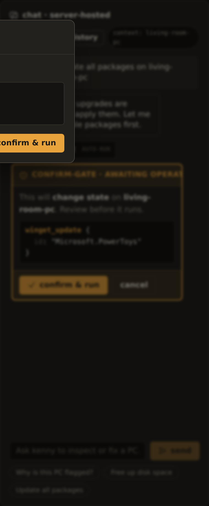
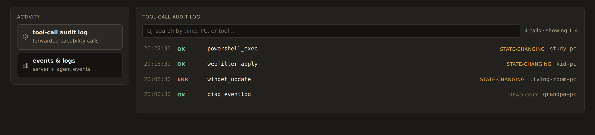

# Tool reference

This page catalogs every tool kenny exposes to Claude — over MCP (a local client) and in
the dashboard chat — and explains which ones can change a PC, who has to approve them, and
where each call is recorded. For the operator workflow around these tools, see
[`user-guide.md`](user-guide.md).

## Two kinds of tools

kenny splits its tools into two families:

- **Capability tools** run on a single agent PC (Windows, Linux, or macOS). Every call names
  its target with an `agent_id` argument, forwards a `request` frame to that agent through
  the tunnel, and returns the agent's `response`. `powershell_exec`, `shell_exec`, the
  `fs_*`, `winget_*`, `diag_*`, `net_*` tools, `screen_capture`, `remotehelp_*`,
  `telemetry_collect`, and `agent_update` are all capability tools. `powershell_exec` and
  `shell_exec` are OS-scoped mirrors of each other (Windows vs. Linux/macOS) — the server's
  **OS guard** (below) refuses to forward the wrong one for a given agent's OS.
- **Server-only orchestration tools** read the registry, telemetry store, and health rules
  on the server. They are **never forwarded** to an agent: `list_agents`, `select_agent`,
  `fleet_overview`, `agent_health`, `agent_snapshot` (plus the server-side web-filter
  tools).

!!! note "`agent_id` targeting, and what `select_agent` actually does now ([ADR-0042](adr/0042-explicit-per-call-agent-targeting.md))"
    A remote MCP client (Claude Desktop, claude.ai) gives the server no reliable
    per-conversation identifier, so **every capability tool call over MCP must include its
    own `agent_id`** naming the target host — there is no server-side "current agent" a raw
    MCP call can rely on. `select_agent` still validates an id and is useful for discovery,
    but it no longer routes anything; passing it once and then omitting `agent_id` on a later
    call fails with an explicit `no_agent` error rather than guessing a host.

    The **dashboard chat** is the one place a sticky selection is still safe, because each
    conversation is a genuinely separate, non-shared session: it forwards to whichever agent
    is selected in the dashboard's context pill, and the model can pass `agent_id` to target
    a different host for one call without changing that selection.

!!! note "Windows-only capabilities stay green on Linux CI"
    Capability tools that touch Windows internals have portable fallbacks in the agent, so
    `cargo test` / `cargo build` pass on Linux dev and CI. On a non-Windows host the
    affected tools return `error.code = "unsupported"` rather than failing the build. This
    is the agent's `#[cfg(windows)]` discipline.

## The confirm-gate & who enforces what

Every tool is classified **read-only** or **state-changing**. In the dashboard chat,
read-only tools run automatically; a state-changing tool call **pauses the loop** and
surfaces a confirmation card to the operator with the exact tool and arguments. The
default policy is **deny** — nothing runs until the operator explicitly approves, and only
then does the loop resume.

*The confirm-gate pausing a state-changing `winget_update` until the operator approves.*

The confirm-gate lives in the **dashboard chat loop**, so it is worth being precise about
what each layer guarantees:

| Control | Where it lives | What it does |
|---------|----------------|--------------|
| **Confirm-gate** | Dashboard chat loop (server) | Pauses every state-changing tool for explicit operator approval; default deny. |
| **Role & host scope** ([ADR-0037](adr/0037-multi-user-authentication.md)) | Auth middleware + tool layer (server) | The access token — an OAuth token ([ADR-0041](adr/0041-oauth2-authorization-server-for-mcp.md)) or a personal access token — identifies a user; a `user`-role caller only sees/targets its assigned hosts (`select_agent`, `agent_*`, forwarders, and `list_agents`/`fleet_overview` are scope-filtered), and parental-controls mutation tools require `operator`+. The legacy shared token acts as a superuser. |
| **Agent-side safety guard** ([ADR-0020](adr/0020-agent-side-deterministic-tool-guard.md)) | Compiled into the agent | Deterministically refuses individually catastrophic calls (disk wipes, shadow-copy deletion, event-log clearing, Defender disable, sensitive-path `fs_*`, unlisted `agent_update` hosts) regardless of operator approval — and it cannot be turned off from the server. |
| **OS guard** | Server (forwarder) | Refuses `powershell_exec`/`shell_exec` for the wrong agent OS — e.g. `shell_exec` on a Windows agent — before ever forwarding, naming the correct tool. |
| **Local kill-switch** ([ADR-0011](adr/0011-local-remote-control-kill-switch.md)) | Agent + tray, at the PC | The person at the PC turns **all** state-changing tools off. Forwarded calls then return `error.code = "disabled"`; telemetry and read-only tools keep working. |

!!! warning "A raw MCP client is not confirm-gated"
    The confirm-gate is a property of the dashboard chat loop, not of the server's tool
    surface. A raw external MCP client (e.g. Claude Desktop) pointed at `/mcp` is **not**
    confirm-gated by the server. The agent-side guard and the local kill-switch still apply
    — they are enforced at the agent, the boundary that actually runs the command — so they
    hold no matter who calls the tool. It also must name its target explicitly: every
    forwarded call takes its own `agent_id` (see the note above), so a raw MCP client can
    never fall back onto whatever host another concurrent session happened to select.

## Capability tools

Names are exactly as they appear on the wire, over MCP, and in the chat. The **Arguments**
column lists only each tool's own parameters — every capability tool additionally takes
`agent_id` naming the target host (required over MCP; optional in the dashboard chat, where
it overrides the session's selection for one call). `agent_id` is routing metadata the
server consumes and never puts on the wire (ADR-0042).

### Shell

`powershell_exec` and `shell_exec` are OS-scoped mirrors: each runs only on its matching
agent OS (Windows / Linux+macOS) and is `unsupported` on the other. The server's **OS
guard** (see the confirm-gate table above) refuses to forward the wrong one before it ever
reaches the agent.

| Tool | Arguments | State-changing? |
|------|-----------|-----------------|
| `powershell_exec` | `script`, `timeout_s` | ✅ |
| `shell_exec` | `command`, `timeout_s` | ✅ |

### Files

| Tool | Arguments | State-changing? |
|------|-----------|-----------------|
| `fs_list` | `path` | read-only |
| `fs_search` | `root`, `pattern` | read-only |
| `fs_read` | `path` | read-only |
| `fs_disk_usage` | — | read-only |

### Packages

| Tool | Arguments | State-changing? |
|------|-----------|-----------------|
| `winget_list` | — | read-only |
| `winget_install` | `id` | ✅ |
| `winget_uninstall` | `id` | ✅ |
| `winget_update` | `id?` | ✅ |

### Diagnostics

| Tool | Arguments | State-changing? |
|------|-----------|-----------------|
| `diag_processes` | — | read-only |
| `diag_services` | `filter?` | read-only |
| `diag_eventlog` | `log`, `count` | read-only |
| `diag_autostart` | — | read-only |

### Network

| Tool | Arguments | State-changing? |
|------|-----------|-----------------|
| `net_config` | — | read-only |
| `net_dns_flush` | — | ✅ |
| `net_adapter_reset` | `name` | ✅ |

### Screen

| Tool | Arguments | State-changing? |
|------|-----------|-----------------|
| `screen_capture` | — | read-only |

Screenshots are captured in the interactive **user session** via the tray helper, not from
the session-0 service (which would grab a black frame) — see
[ADR-0018](adr/0018-screenshots-captured-in-user-session-via-tray.md).

### Remote help

| Tool | Arguments | State-changing? |
|------|-----------|-----------------|
| `remotehelp_status` | — | read-only |
| `remotehelp_start` | — | ✅ |
| `remotehelp_stop` | — | ✅ |

`remotehelp_start` launches Windows **Quick Assist** on the user's desktop; kenny acts as a
concierge, not the transport. A helper shares the 6-digit code and the person at the PC
must click **Allow** — the consent steps stay with the people
([ADR-0022](adr/0022-remote-help-concierge-via-user-session-launch.md)).

### Telemetry

| Tool | Arguments | State-changing? |
|------|-----------|-----------------|
| `telemetry_collect` | `sections?` | read-only |

### Agent management

| Tool | Arguments | State-changing? |
|------|-----------|-----------------|
| `agent_update` | `version`, `url`, `sha256` | ✅ |

### Parental controls

Registered on the agent when the web filter is wired up. See
[`parental-controls.md`](parental-controls.md).

| Tool | Arguments | State-changing? |
|------|-----------|-----------------|
| `webfilter_status` | — | read-only |
| `webfilter_apply` | `domains`, `doh_policy`, `list_hash` | ✅ |
| `webfilter_clear` | — | ✅ |

## Server-only orchestration tools

These read server state and are never forwarded. All are read-only.

| Tool | Arguments | Purpose |
|------|-----------|---------|
| `list_agents` | — | Known agents with online state and rolled-up health. |
| `select_agent` | `id` | Validate an agent id and set the dashboard chat's default (advisory only over MCP — it does not route forwarded calls there; see the note above). |
| `fleet_overview` | — | Per-agent rolled-up health for the whole fleet. |
| `agent_health` | `id` | Per-section health status/summary for one agent. |
| `agent_snapshot` | `id`, `section?` | Latest stored telemetry snapshot (optionally one section). |

The server-side web-filter tools are also server-only. `webfilter_get` and
`web_activity_query` are read-only; `webfilter_set` and `webfilter_push` are
state-changing (they change server-held policy or push a new block list to the agent).

| Tool | Arguments | State-changing? |
|------|-----------|-----------------|
| `webfilter_get` | `id` | read-only |
| `webfilter_set` | `id`, plus config toggles / `add_domain` / `remove_domain` | ✅ |
| `webfilter_push` | `id` | ✅ |
| `web_activity_query` | `id`, `hours?`, `flagged_only?` | read-only |

## Auditing

Every forwarded capability call is appended to the **tool-call audit log**, annotated
read-only vs state-changing, with its agent, timestamp, and ok/error outcome. Read it in
the dashboard under **Activity → tool-call audit**. See [`dashboard.md`](dashboard.md).

*The tool-call audit log, each call tagged read-only or state-changing.*

## Tool naming

Tools use **Anthropic-native `snake_case` names**, identical to the wire-contract tool
catalog ([ADR-0016](adr/0016-anthropic-native-tool-naming.md)). There is one canonical
identifier per tool across the contract, fixtures, MCP, the dashboard chat, and the agent's
dispatch table — no boundary translation. The same names you see here appear over MCP and
in the chat.

## See also

- [`user-guide.md`](user-guide.md) — the operator workflow around these tools.
- [`dashboard.md`](dashboard.md) — the fleet view, drill-down, and Activity tab.
- [`protocol.md`](protocol.md) — the authoritative agent⇄server wire contract.
