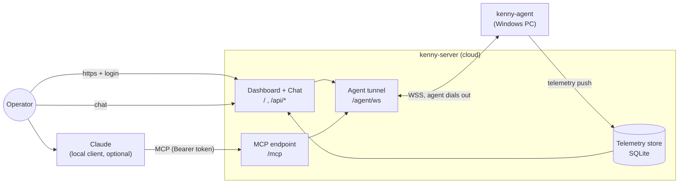
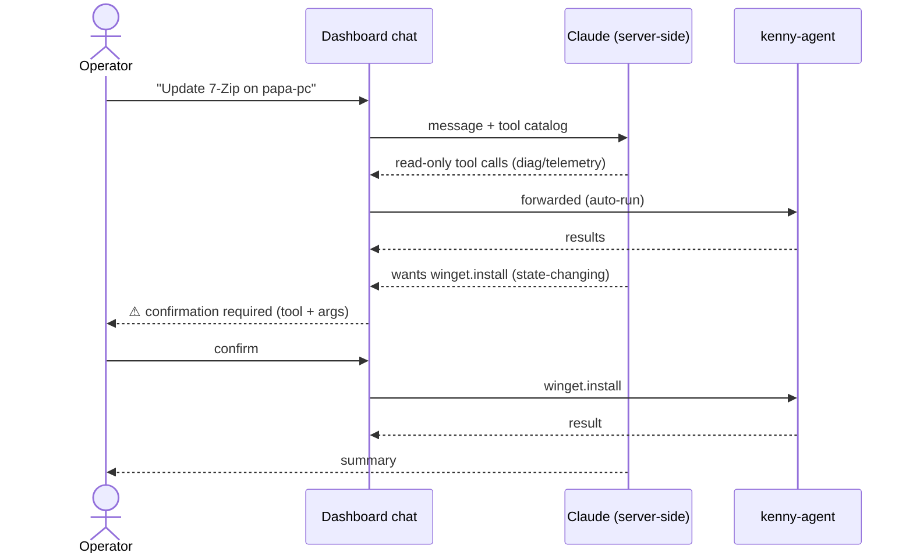
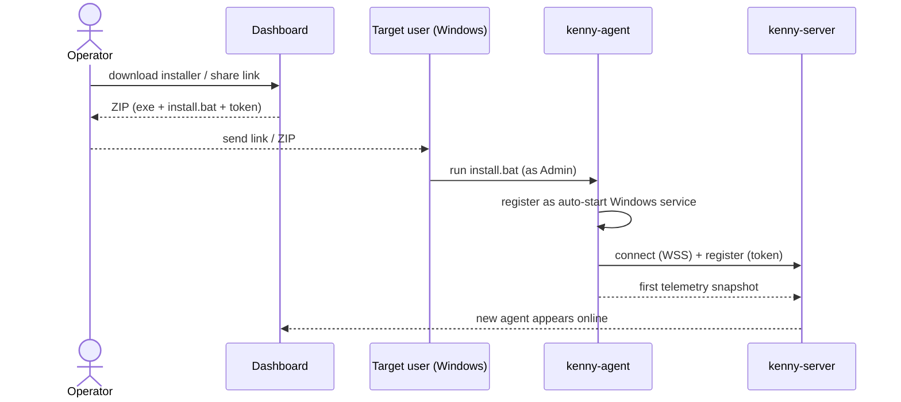
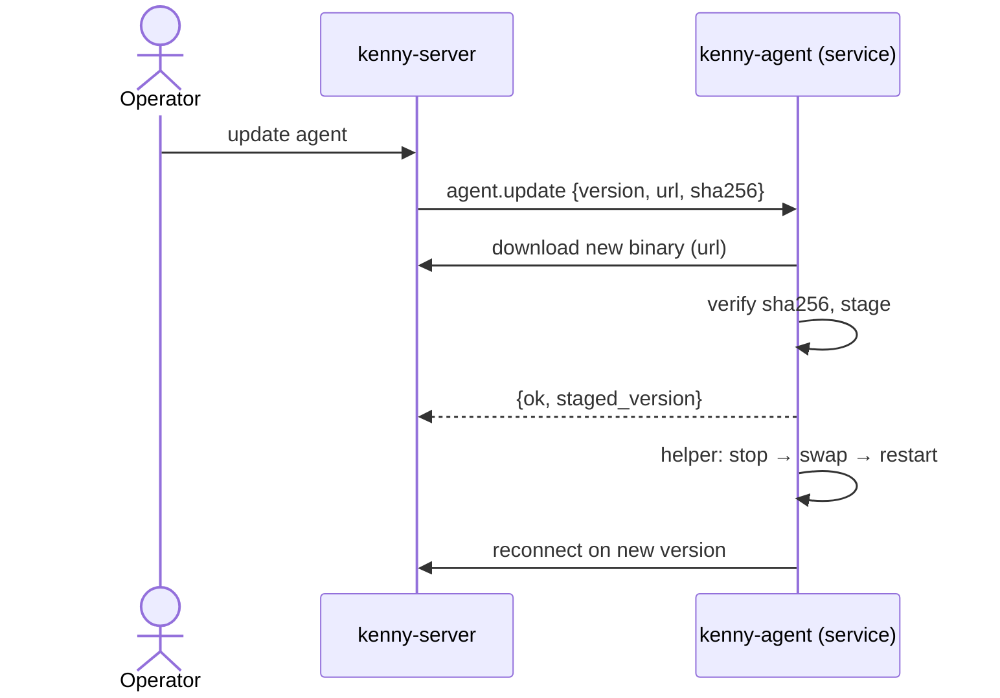

# kenny — User Guide

This guide is for the **operator**: the person who watches the family's Windows PCs and runs
commands on them through kenny. For installing and hosting the server, see
[`setup.md`](setup.md).

## What kenny gives you

- A **fleet dashboard** showing every PC's health at a glance (a traffic light per machine).
- A **drill-down** per PC: telemetry sections, a health trend, and a tool-call log.
- Two ways to act on a PC: talk to **Claude** (which calls kenny's tools), either from a local
  Claude client over MCP or from the **chat built into the dashboard** — no local client needed.
- One-click **agent installer download** (and a shareable link) plus **server-triggered updates**.

## The pieces

The agent always **dials out** to the server (NAT/firewall friendly) and authenticates with its
own per-agent token; you authenticate to the server with the **operator token**.

## Signing in

1. Open the server in a browser (e.g. `https://kenny.example.com/`).
2. You are redirected to `/login`. Enter the **operator token** (set by whoever runs the server as
   `KENNY_OPERATOR_TOKEN`). A cookie keeps you signed in; `/logout` clears it.

> The same operator token is what a local Claude client sends as `Authorization: Bearer <token>` to
> the `/mcp` endpoint.

## The fleet view

Each PC is a tile with a status dot:

| Dot | Status | Meaning |
|-----|--------|---------|
| 🟢 | `ok` | nothing flagged |
| 🟡 | `warn` | something needs attention (e.g. disk > 80 %, aging battery) |
| 🔴 | `crit` | acute problem (e.g. Defender real-time protection off, disk ≥ 95 %) |
| ⚪ | `unknown`/offline | no recent telemetry / agent not connected |

The header shows the **worst-of** health across the whole fleet. Click a tile to drill in.

## The agent drill-down

- **Sections** — each telemetry section with its status, a one-line summary, the server's health
  rule reason, and the raw fields.
- **Health trend** — recent snapshots as colored bars.
- **Tool-call log** — every tool run against this agent (ok / error), for audit.
- Action buttons: **refresh now**, **download installer**, **share link**, **update agent**.

Telemetry sections cover: disk & SMART, memory, CPU/thermals, uptime, network & routing, Wi‑Fi,
Defender (+ quarantine), third-party AV, firewall, BitLocker, Windows Update & app updates,
reboot-pending, OS support/EOL, services, autostart, peripherals, printers, battery, reliability,
and time sync. Health thresholds are evaluated **server-side** (authoritative); the agent also sets
a reasonable per-section status.

## Running commands on a PC

### Option A — the dashboard chat (no local client)

Open the **chat** tab and ask in plain language (“is Defender on for papa-pc?”, “free up disk on
oma-laptop”). Claude picks the right kenny tools and runs them.

**Confirm-gate:** read-only tools (diagnostics, `fs.read`/`list`/`search`, `telemetry.collect`,
`*.list`, `screen.capture`) run automatically. Anything **state-changing** —
`powershell.exec`, `winget.install/uninstall/update`, `net.dns_flush`, `net.adapter_reset`,
`agent.update` — pauses for your explicit confirmation before it runs. Every call is recorded in the
tool-call log.

### Option B — a local Claude client over MCP

Point any MCP client at `https://<server>/mcp` with the operator token as a bearer credential. The
same tools are available; `select_agent` chooses the target PC.

### Tool catalog

| Family | Tools | Changes state? |
|--------|-------|----------------|
| Shell | `powershell.exec` | ✅ |
| Packages | `winget.list` · `winget.install` · `winget.uninstall` · `winget.update` | install/uninstall/update ✅ |
| Files | `fs.list` · `fs.search` · `fs.read` · `fs.disk_usage` | read-only |
| Diagnostics | `diag.processes` · `diag.services` · `diag.eventlog` · `diag.autostart` | read-only |
| Network | `net.config` · `net.dns_flush` · `net.adapter_reset` | dns_flush/adapter_reset ✅ |
| Screen | `screen.capture` | read-only |
| Telemetry | `telemetry.collect` | read-only |
| Agent mgmt | `agent.update` | ✅ |
| Server-only | `list_agents` · `select_agent` · `fleet_overview` · `agent_health` · `agent_snapshot` | read-only |

## Adding a PC to the fleet

From an agent's drill-down, **download installer** gives you a ZIP (the agent binary + an
`install.bat` pre-filled with the server URL, this agent's id, and a freshly minted token). Or use
**share link** to send the target user a one-time, expiring download link they can open without your
login.

The installer registers the agent as an **auto-starting Windows service** (restart-on-failure), so
it survives reboots. To remove it: `kenny-agent.exe uninstall`.

## Updating an agent

**update agent** pushes a server-triggered self-update. The agent downloads the new binary from the
server, verifies its SHA-256 **before** swapping, then a helper stops the service, replaces the
binary (with rollback on failure), and restarts it.

## Good habits for operators

- Treat `powershell.exec` and the `winget`/`net` write tools as real admin power — confirm
  deliberately. Screenshots and `fs.read` can expose private content; use them sparingly.
- Telemetry summaries come from the agent; the dashboard is for **your** family's machines only.
- If a PC shows `crit`, open it and read the section reason before acting.
- Rotate a PC's token (re-download the installer) if you suspect a leaked token.

See [`setup.md`](setup.md) for hosting, TLS, environment variables, and releases.
